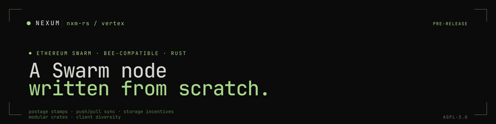

<p align="center">
  
</p>

# Nexum · vertex

A new **Ethereum Swarm** node implementation in Rust — modular, high-performance, Bee-compatible. Vertex aims to be the fastest Swarm client while being easy to run on consumer hardware, and to contribute meaningful client diversity to the network.

Nexum builds on Swarm for content-addressed storage of firewall rulesets, snapshots, and shared state. Vertex is how we run our own node infrastructure for that.

> Looking for the org overview? See **[github.com/nxm-rs](https://github.com/nxm-rs)**.

---

## Status

| | |
|---|---|
| Version | **0.1.0-dev** · pre-release |
| Compat | Bee protocols: postage stamps, push/pull syncing, storage incentives |
| MSRV | Rust 1.87 · edition 2024 |
| License | [AGPL-3.0-or-later](./LICENSE) |

> Vertex is under active development and **not yet ready for production use**. Run on testnets or in lab environments only.

---

## Goals

1. **Modularity.** Every component is a library: well-tested, documented, benchmarked. Developers should be able to import the chunk store, a network protocol, or the storage-incentives module and build on top.
2. **Performance.** Concurrent processing, careful resource usage, no accidental synchronisation. We measure where it matters.
3. **Client diversity.** The Swarm network becomes more resilient when no single implementation dominates. A second production-grade client is good for everyone.
4. **Developer experience.** Ergonomic APIs, useful errors, real docs. A CLI (`dipper`, modelled on `cast`) for hands-on Swarm work — coming as a sibling repo.

---

## Sibling repos

Vertex isn't shipped in isolation. The Swarm work under [nxm-rs](https://github.com/nxm-rs) is split across:

| Repo | Role |
|---|---|
| **[vertex](https://github.com/nxm-rs/vertex)** | Full node implementation (this repo) |
| **[nectar](https://github.com/nxm-rs/nectar)** | Low-level Swarm primitives — chunks, addressing, postage |
| **[bee](https://github.com/nxm-rs/bee)** | Reference Go client (fork; we contribute upstream) |
| **[swarm-contracts](https://github.com/nxm-rs/swarm-contracts)** | Economic-layer contracts · Solady + Foundry |
| **[apiarist](https://github.com/nxm-rs/apiarist)** | In-network stress tester |
| **[apiary](https://github.com/nxm-rs/apiary)** | One-command stack: Reth + Bee + supporting services |
| **[SWIPs](https://github.com/nxm-rs/SWIPs)** | Swarm Improvement Proposals |

---

## Build from source

```bash
git clone https://github.com/nxm-rs/vertex
cd vertex
cargo build --release
```

Binary lands at `target/release/vertex`. CLI documentation lives under [`docs/`](./docs); operational guides are still in progress.

---

## Workspace layout

```
vertex/
├── bin/
│   └── vertex/             ← node binary
└── crates/
    ├── primitives/         ← shared chunk + addressing types
    ├── tasks/              ← async task plumbing
    ├── net/
    │   ├── primitives/     ← network types
    │   ├── codec/          ← wire-format codec
    │   ├── protocols/      ← handshake, headers, hive, pricing,
    │   │                     pingpong, pushsync, retrieval
    │   ├── topology/       ← peer-set management
    │   └── client/         ← outbound protocol clients
    ├── node/
    │   ├── types/          ← node-level types
    │   ├── api/            ← internal APIs
    │   └── core/           ← orchestration
    └── …                   ← see Cargo.toml for the full set
```

Internals are intentionally split into many small crates so external consumers can take just the pieces they need.

---

## Contributing

Pre-release codebase under heavy churn — open an issue before opening a PR for non-trivial work so we don't collide.

Highlights:

- **Rust** — `cargo fmt`, `cargo clippy -- -D warnings`. Edition 2024, MSRV 1.87.
- **Commits** — Conventional Commits. `feat`, `fix`, `perf`, `refactor`, `test`, `docs`, `chore`.
- **No new dependencies** without a justification in the PR description.
- **Tests for protocol changes are non-optional.** Net-code regressions are expensive to debug after the fact.

## Getting help

- File an issue (or open a [discussion](https://github.com/nxm-rs/vertex/discussions/new)) for questions about the codebase
- Bug reports go on this repo with a reproducer
- Security findings → see [SECURITY.md](https://github.com/nxm-rs/.github/blob/main/SECURITY.md) or email `security@nxm.rs`

## License

AGPL-3.0-or-later. See [LICENSE](./LICENSE).

## Warning

This software is under active development. Bugs exist. Do not run on mainnet with funds at risk.

```
●  AGPL-3.0  ·  pre-release  ·  bee-compatible
```
