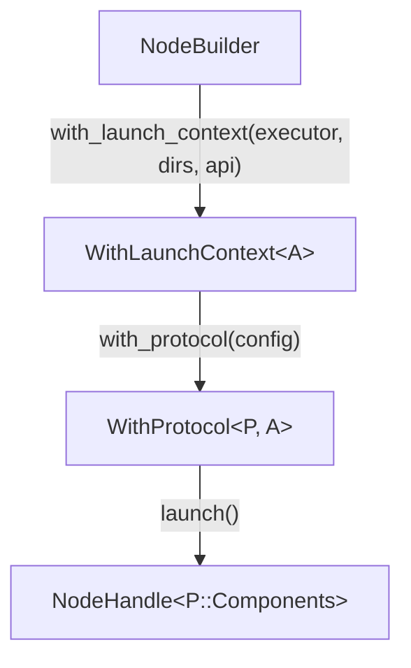
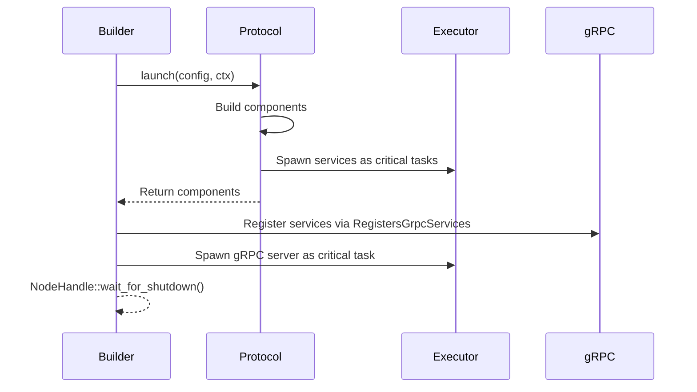

# Node Builder Architecture

The `vertex-node-builder` crate provides the type-state builder pattern for launching Vertex nodes.

## Type-State Pattern

The builder uses a type-state pattern where each stage is a distinct type, ensuring compile-time correctness of the launch sequence:

The protocol type `P` is inferred from the config type via the `NodeBuildsProtocol` trait: passing a config that implements `NodeBuildsProtocol` with `type Protocol = SwarmProtocol<Self>` tells the builder exactly which protocol to construct.

## Launch Context

The `LaunchContext` provides infrastructure to protocols during launch:

| Component | Purpose |
|-----------|---------|
| **TaskExecutor** | Spawns background tasks as critical (node shuts down on panic) |
| **DataDirs** | Persistent storage directories |
| **API config** | gRPC address and port |

It implements `InfrastructureContext` so protocols receive it directly during the launch phase.

## State Accumulation

The `Attached<L, R>` type enables accumulating state while preserving access to previous values. This pattern avoids losing access to earlier configuration as the launch sequence progresses: each `attach()` call wraps the existing state, and both the left (previous) and right (new) values remain accessible.

## Service Lifecycle

1. **Protocol launch**: `NodeProtocol::launch()` builds components and spawns services
2. **gRPC registration**: Components implement `RegistersGrpcServices` to add their RPC methods
3. **Server spawn**: gRPC server spawned as critical task
4. **Shutdown**: `NodeHandle::wait_for_shutdown()` waits for signal or critical task panic

All services are spawned as critical tasks: if any panics, the node shuts down gracefully.

## Metrics Integration

Metrics are optionally attached via `LaunchContextExt`. When enabled, a Prometheus recorder is installed globally and the HTTP server exposes `/metrics`.
