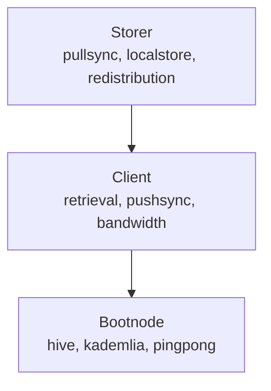

# Node Types

Vertex supports three node types, each with different capabilities and resource requirements.

## Node Types

| Node Type | Description | Use Case |
|-----------|-------------|----------|
| **Bootnode** | Topology only (handshake, hive, pingpong). No pricing or accounting. | Network infrastructure, peer discovery |
| **Client** | Read + write (retrieval, pushsync, pricing, bandwidth accounting). Consumes the network without storing chunks locally. | Content access, uploads, dApp backends |
| **Storer** | Storage + staking (pullsync, local storage, redistribution). Stores chunks locally and participates in the storage incentive game. | Network infrastructure, earning rewards |

## CLI Selection

```bash
vertex node --mode <bootnode|client|storer>  # default: client
```

## Service Requirements

| Node Type | Hive | Bandwidth | Retrieval | Upload | Pullsync | Redistribution |
|-----------|:----:|:---------:|:---------:|:------:|:--------:|:--------------:|
| **Bootnode** | Yes | No | No | No | No | No |
| **Client** | Yes | Yes | Yes | Yes | No | No |
| **Storer** | Yes | Yes | Yes | Yes | Yes | Optional |

## Service Descriptions

### Hive/Topology
Kademlia peer discovery and routing table maintenance. All nodes participate in the DHT to find peers and route requests.

### Bandwidth Accounting
Fair resource usage tracking. Soft accounting (pseudosettle) is always on for client and storer nodes; monetary settlement (SWAP, cheques over a chequebook) is opt-in. Required for any data transfer. See [Accounting and settlement](../design/accounting-settlement.md) for the full model.

### Retrieval
Fetching chunks from peers using the retrieval protocol. Requires bandwidth accounting.

### Upload (Pushsync)
Writing chunks to the network. Requires valid postage stamps.

### Pullsync
Synchronising chunks with neighbourhood peers. Storage nodes pull chunks they are responsible for based on overlay address proximity.

### Redistribution
Participating in the storage incentive game. Requires staking BZZ tokens. Nodes prove they store chunks and earn rewards.

## Identity Requirements

| Node Type | Wallet | Nonce | Reason |
|-----------|:------:|:-----:|--------|
| **Bootnode** | Ephemeral OK | Ephemeral OK | No incentives, no storage responsibility |
| **Client** | Persistent recommended | Ephemeral OK | Postage batches tied to wallet |
| **Storer** | Persistent | Persistent | Overlay address determines storage responsibility, staking tied to wallet |

## Bandwidth Settlement

Settlement is two roles on different debt bases, not a configurable mode enum. Bootnodes have no accounting.

| Node Type | Soft accounting (pseudosettle) | Monetary settlement (SWAP) |
|-----------|:------------------------------:|----------------------------|
| **Bootnode** | No | No |
| **Client** | Always on | Off by default; `--swap` opts in (chequebook over chain) |
| **Storer** | Always on | On by default; `--swap=false` opts out |

Soft accounting forgives total debt over time at the configured refresh rate and is always on for client and storer nodes. SWAP settles only originated debt and is selected by node type plus the `--swap` flag, which overrides the per-node-type default either way. There is no runtime mode enum. For the ledger, the two settlement roles, and how they are selected at build time, see [Accounting and settlement](../design/accounting-settlement.md).

## Protocol Dependency Diagram



Each layer builds on the one below. A Storer node runs all protocols from Bootnode through Pullsync/Redistribution.

## Implementation Status

| Node Type | Status |
|-----------|--------|
| **Bootnode** | Implemented |
| **Client** | Implemented |
| **Storer** | Storage and pullsync implemented; redistribution pending |

## Type System Representation

The node types are represented internally as a capability trait hierarchy: `SwarmPrimitives` → `SwarmNetworkTypes` → `SwarmClientTypes` → `SwarmStorerTypes`. Each level adds associated types for additional services. Bootnode needs `SwarmNetworkTypes`, Client needs `SwarmClientTypes`, and Storer needs `SwarmStorerTypes`.

For the full trait hierarchy diagram and details, see [Swarm API](../swarm/api.md#trait-hierarchy).

## See Also

- [CLI Configuration](../cli/configuration.md) - How to configure each node type
- [Swarm API](../swarm/api.md) - Protocol trait definitions
