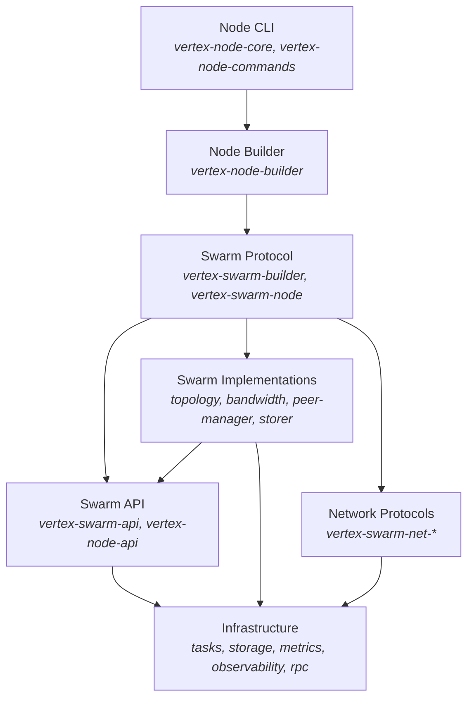
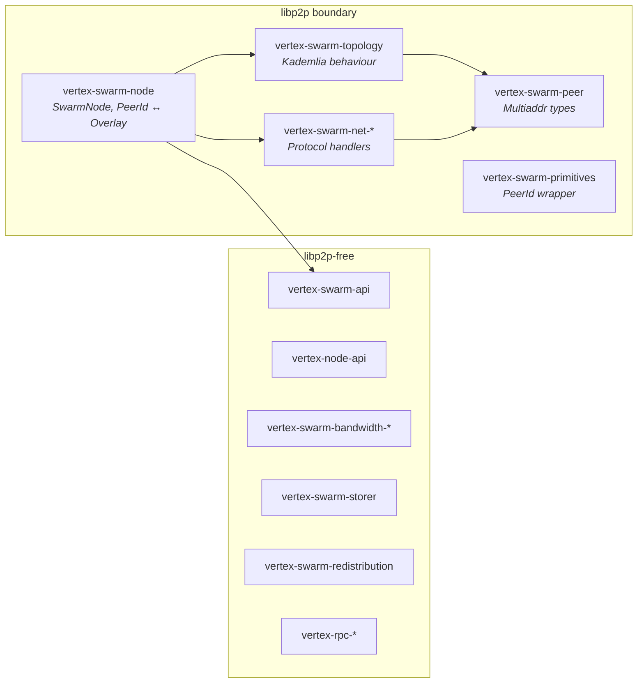
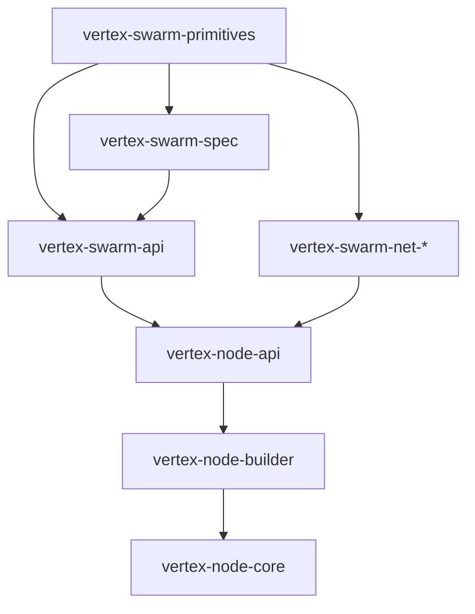

# Architecture Overview

This document describes the high-level architecture of Vertex and how its crates are organised.

## Design Principles

1. **Modularity**: Every component is designed to be used as a library: well-tested, documented, and benchmarked. Developers can import individual components and build custom solutions.

2. **Layered Abstraction**: Clear separation between protocol definitions (traits) and implementations. The `vertex-swarm-api` crate defines *what* Swarm does; implementation crates define *how*.

3. **libp2p Boundary**: libp2p dependencies are confined to specific crates (`vertex-swarm-node`, `vertex-swarm-peer`, `vertex-swarm-net-*`). Higher-level crates like `vertex-swarm-api` and `vertex-node-api` are libp2p-agnostic, enabling alternative transports and easier testing.

4. **Type Safety**: Rust's type system enforces correctness at compile time. The `SwarmPrimitives` trait hierarchy ensures components are compatible before the code ever runs.

## Crate Organisation

For the full crate listing, see the [root README](../../README.md#architecture). The diagrams below show how the crates relate to each other.

### Layer Diagram

The architecture follows a strict layering where each layer depends only on the layers below it:

### libp2p Boundary

libp2p is confined to a specific set of crates. All Swarm domain logic operates on `OverlayAddress` (32-byte Swarm address), not libp2p `PeerId`. The mapping between the two happens exclusively in `vertex-swarm-node`.

## Key Abstractions

### SwarmPrimitives Trait Hierarchy

The type system models node capabilities as a trait hierarchy. Each level adds new associated types that represent additional services the node can provide:

| Trait | Adds | Node Types |
|-------|------|------------|
| `SwarmPrimitives` | `Spec`, `Identity` | All |
| `SwarmNetworkTypes` | `Topology` | All (extends `SwarmPrimitives`) |
| `SwarmClientTypes` | `Accounting` | Client, Storer (extends `SwarmNetworkTypes`) |
| `SwarmStorerTypes` | `Store` | Storer only (extends `SwarmClientTypes`) |

Each trait level has a corresponding component container that holds concrete instances at runtime:

| Container | Holds |
|-----------|-------|
| `BootnodeComponents<T>` | Topology |
| `ClientComponents<T, A>` | Topology + Accounting |
| `StorerComponents<T, A, S>` | Topology + Accounting + Store |

Component access is abstracted via `HasTopology`, `HasAccounting`, `HasStore`, and `HasIdentity` traits, so code can be generic over the node type.

### NodeProtocol Trait

The `NodeProtocol` trait (in `vertex-node-api`) defines the lifecycle of a network protocol within the node infrastructure. A protocol receives an `InfrastructureContext` (providing a `TaskExecutor` and data directory), builds its components, spawns background services, and returns the components for continued use by RPC and metrics.

`SwarmProtocol` (in `vertex-swarm-api`) implements `NodeProtocol` for the Swarm protocol, bridging the generic node infrastructure with Swarm-specific services.

### Protocol vs Node Architecture

| Layer | Purpose | Key Traits |
|-------|---------|------------|
| **Swarm API** | Defines *what* Swarm does | `SwarmPrimitives`, `SwarmClientTypes`, `SwarmIdentity`, `SwarmTopology`, `SwarmBandwidthAccounting` |
| **Node API** | Defines *how* a node is composed | `NodeProtocol`, `NodeBuildsProtocol`, `InfrastructureContext` |

### Dependency Flow

## See Also

- [Node Types](node-types.md) - Detailed explanation of node type hierarchy
- [Node Builder](node-builder.md) - Type-state builder pattern
- [Chunks](chunks.md) - Chunk architecture and storage
- [Swarm API](../swarm/api.md) - Protocol trait definitions
- [Client Architecture](../client/architecture.md) - libp2p integration layer
