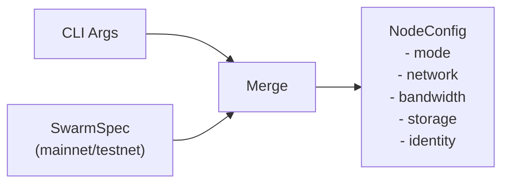

# CLI Configuration

This document describes the configuration architecture and how CLI arguments map to node configuration.

## Quick Start

```bash
# Client node on mainnet (default mode)
vertex node --mainnet

# Bootnode for peer discovery only
vertex node --mainnet --mode=bootnode

# See all available options
vertex node --help
```

## Configuration Architecture

CLI arguments are organised into logical groups that correspond to node subsystems: network, bandwidth, storage, identity, and network selection.



The `SwarmSpec` provides network-level constants (network ID, bootnodes, contract addresses, default pricing parameters). CLI arguments provide node-level configuration (ports, capacity, node type, settlement selection) and can override network defaults where appropriate.

## Argument Groups

| Group | Prefix | Applies To | Purpose |
|-------|--------|------------|---------|
| **Mode** | `--mode` | All | Node type selection (bootnode, client, storer) |
| **Network** | `--network.*` | All | P2P listen address/port, bootnodes, max peers, NAT |
| **Bandwidth** | `--bandwidth.*` | Client, Storer | Accounting mode, pricing, thresholds |
| **Storage** | `--storage.*` | Storer | Reserve capacity, cache size, redistribution |
| **Identity** | `--password`, `--nonce`, etc. | All | Keystore, overlay nonce, ephemeral mode |
| **Database** | `--db.*` | All | Opt-in database persistence and cache size |
| **Network selection** | `--mainnet`, `--testnet` | All | Which Swarm network to join |
| **Logging** | `-v`/`-q`, `--log.json` | All | Console verbosity and format |
| **Metrics** | `--metrics`, `--metrics.*` | All | Prometheus endpoint, address, port, prefix |
| **Tracing** | `--tracing`, `--tracing.*` | All | OTLP trace and log export |

Run `vertex node --help` for the full argument listing with defaults.

## Configuration Resolution

The `NodeProtocolConfig` trait (in `vertex-node-api`) defines how protocol-specific configuration is structured. Each protocol provides a `Args` type (a clap `Args` struct) and an `apply_args` method that merges CLI overrides into the loaded configuration.

The merge order is:

1. **Defaults** from `SwarmSpec` and built-in configuration
2. **Config file** overrides (if `--swarmspec` is provided)
3. **CLI argument** overrides (highest priority)

This ensures operators can set base configuration in a file and selectively override individual values from the command line.

## Database Persistence

The node database is in-memory by default: nothing is written to disk and all database state is lost on shutdown. Persistence is opt-in:

| Flag | Effect |
|------|--------|
| `--db.persist` | Persist the database at the default location `<datadir>/<network>/db/vertex.redb` |
| `--db.path <PATH>` | Persist the database at a custom file path (implies `--db.persist`) |
| `--db.cache <MB>` | Database cache size in megabytes |

When both `--db.path` and `--db.persist` are given, the explicit path wins.

What persistence covers: peer snapshots (the identity-only records described in [Peer Management](../networking/peer-management.md)), written periodically and on shutdown so a restarted node warm-starts its peer set. Peer scores, bans, and dial backoff are runtime-only and are never persisted in either mode. If the configured database cannot be opened, the node logs a warning and continues fully in-memory rather than aborting.

## Bandwidth accounting

Soft accounting (pseudosettle) is always on for client and storer nodes; it needs no flag. Monetary settlement (SWAP) is opt-in via `--swap` and selected purely by that flag plus the node type.

## Observability Flags

All three observability surfaces (logging, metrics, tracing) are opt-in where they have a runtime cost, and every flag listed here is parsed and consumed by the binary.

### Logging

| Flag | Effect |
|------|--------|
| `-v`, `-vv`, `-vvv` | Raise console verbosity (`info` -> `debug` -> `trace`). Counts, so repeat the flag. |
| `-q`, `--quiet` | Silence all console output. |
| `--log.json` | Emit JSON-formatted logs instead of the human-readable terminal format. ANSI colour is auto-detected from whether stdout is a terminal. |

`RUST_LOG` overrides the `-v`/`-q` derived filter entirely: when `RUST_LOG` is set in the environment, the console layer uses it and ignores the verbosity flags. Use `RUST_LOG` for per-target filtering (for example `RUST_LOG=vertex_swarm_topology=debug,info`).

### Metrics

The metrics endpoint is disabled unless `--metrics` is passed. When enabled it serves `/metrics`, `/health`, and (with the profiling build features) the `/debug/*` profiling routes.

| Flag | Default | Effect |
|------|---------|--------|
| `--metrics` | off | Enable the Prometheus metrics HTTP endpoint. |
| `--metrics.addr <IP>` | `127.0.0.1` | Listen address. |
| `--metrics.port <PORT>` | `1637` | Listen port. |
| `--metrics.prefix <STR>` | `vertex` | Prefix applied to every metric family (including `process_*` and `executor_*`). |
| `--metrics.upkeep-interval <SECS>` | `5` | How often the recorder runs upkeep. |

> The metrics server is unauthenticated and exposes profiling/memory/heap debug routes alongside `/metrics`. Keep it on `127.0.0.1` (the default) or firewalled. See the [Local Stack README](../../observability/README.md) for the security notes.

### Tracing

OTLP trace and log export are disabled unless `--tracing` (and `--tracing.logs` respectively) are passed.

| Flag | Default | Effect |
|------|---------|--------|
| `--tracing` | off | Enable OTLP trace export. |
| `--tracing.endpoint <URL>` | `http://localhost:4317` | OTLP gRPC endpoint (Tempo/Jaeger). |
| `--tracing.service-name <STR>` | `vertex-swarm` | Service name reported in traces. |
| `--tracing.sampling-ratio <F>` | `1.0` | Fraction of traces sampled (0.0 to 1.0). Lower it on busy nodes. |
| `--tracing.logs` | off | Enable OTLP log export (for example to Loki). |
| `--tracing.logs-endpoint <URL>` | `http://localhost:3100/otlp/v1/logs` | OTLP log export endpoint. |

## See Also

- [Configuration Architecture](../architecture/config.md) - Internal three-tier config pattern (Args, Config, ValidatedConfig)
- [Node Types](../architecture/node-types.md) - Detailed node type descriptions
- [Node Builder](../architecture/node-builder.md) - How configuration flows into the builder
- [Swarm API](../swarm/api.md) - Protocol traits and accounting
- [Observability Design](../observability/design.md) - Metrics, spans, and the metric reference
