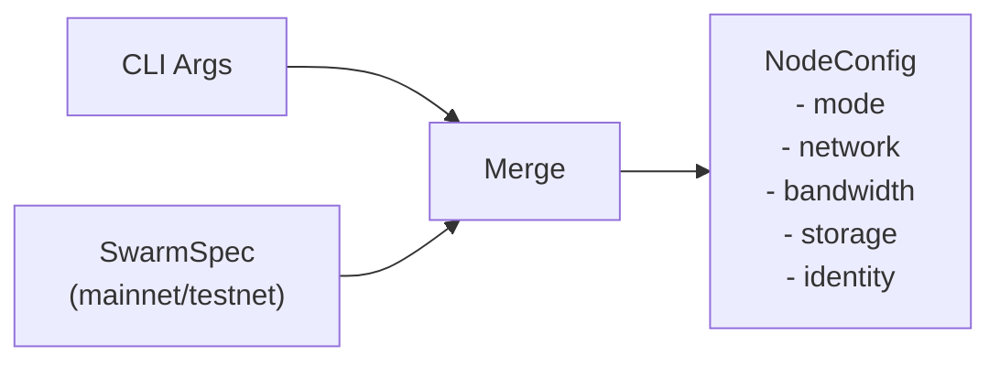

# CLI Configuration

This document describes the configuration architecture and how CLI arguments map to node configuration.

## Quick Start

```bash
# Client node on mainnet (default mode)
vertex node --mainnet

# Bootnode for peer discovery only
vertex node --mainnet --mode=bootnode

# See all available options
vertex node --help
```

## Configuration Architecture

CLI arguments are organised into logical groups that correspond to node subsystems: network, bandwidth, storage, identity, and network selection.



The `SwarmSpec` provides network-level constants (network ID, bootnodes, contract addresses, default pricing parameters). CLI arguments provide node-level configuration (ports, capacity, mode selection, accounting mode) and can override network defaults where appropriate.

## Argument Groups

| Group | Prefix | Applies To | Purpose |
|-------|--------|------------|---------|
| **Mode** | `--mode` | All | Node type selection (bootnode, client, storer) |
| **Network** | `--network.*` | All | P2P listen address/port, bootnodes, max peers, NAT |
| **Bandwidth** | `--bandwidth.*` | Client, Storer | Accounting mode, pricing, thresholds |
| **Storage** | `--storage.*` | Storer | Reserve capacity, cache size, redistribution |
| **Identity** | `--password`, `--nonce`, etc. | All | Keystore, overlay nonce, ephemeral mode |
| **Network selection** | `--mainnet`, `--testnet` | All | Which Swarm network to join |

Run `vertex node --help` for the full argument listing with defaults.

## Configuration Resolution

The `NodeProtocolConfig` trait (in `vertex-node-api`) defines how protocol-specific configuration is structured. Each protocol provides a `Args` type (a clap `Args` struct) and an `apply_args` method that merges CLI overrides into the loaded configuration.

The merge order is:

1. **Defaults** from `SwarmSpec` and built-in configuration
2. **Config file** overrides (if `--swarmspec` is provided)
3. **CLI argument** overrides (highest priority)

This ensures operators can set base configuration in a file and selectively override individual values from the command line.

## Bandwidth Modes

| Mode | Description | Use Case |
|------|-------------|----------|
| **none** | No accounting | Bootnodes (set automatically) |
| **pseudosettle** | Soft accounting without real payments | Default, testing, trusted networks |
| **swap** | Payment channels with chequebook | Production with real payments |
| **both** | Pseudosettle until threshold, then SWAP | Hybrid approach |

## See Also

- [Node Types](../architecture/node-types.md) - Detailed node type descriptions
- [Node Builder](../architecture/node-builder.md) - How configuration flows into the builder
- [Swarm API](../swarm/api.md) - Protocol traits and accounting
