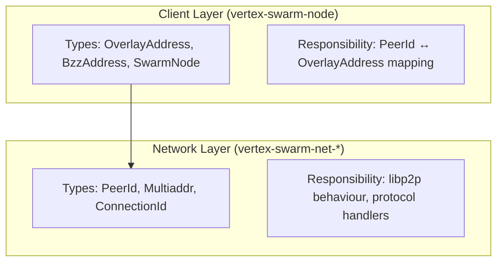
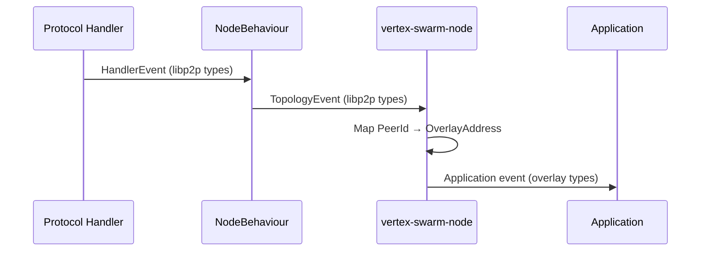
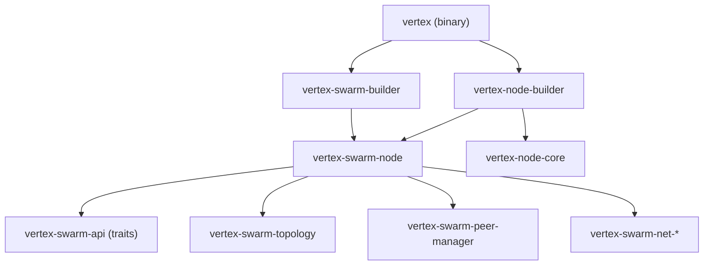

# Client Layer Architecture

The client layer bridges libp2p networking with Swarm's overlay network. This is where the libp2p boundary is defined.

## Abstraction Boundary

## Key Principle

**Network crates use libp2p types only.** They have no knowledge of Swarm overlay addresses.

The client layer owns the mapping between:
- `PeerId` (libp2p transport identity)
- `OverlayAddress` (Swarm network address derived from Ethereum key)

## Target Architecture

The architecture is organised into four layers, each with clear libp2p boundaries:

| Layer | Crate | libp2p | Responsibility |
|-------|-------|:------:|----------------|
| **Node infrastructure** | `vertex-node-core` | No | Generic logging, config, CLI args |
| **Swarm API** | `vertex-swarm-api` | No | Trait definitions (`SwarmPrimitives`, `SwarmClientTypes`, `SwarmStorerTypes`) |
| **Swarm Node** | `vertex-swarm-node` | **Yes** | libp2p adapter, `SwarmNode` wrapping `libp2p::Swarm`, PeerId ↔ OverlayAddress translation |
| **Network protocols** | `vertex-swarm-net-*` | **Yes** | Raw libp2p protocol implementations (handshake, retrieval, pushsync, pricing, hive, etc.) |

`vertex-swarm-node` is the boundary: it implements the traits from `vertex-swarm-api` using the protocol handlers from `vertex-swarm-net-*`.

## Event Flow

## Why This Boundary?

1. **Testability**: Swarm logic can be tested without libp2p mocking
2. **Reusability**: Network behaviour works with any identity scheme
3. **Clarity**: Clear ownership of the PeerId ↔ Overlay mapping
4. **Future-proofing**: Could support alternative transports (WASM, QUIC-only, etc.)

## libp2p Boundary Crate

`vertex-swarm-peer` is the designated libp2p boundary crate where `libp2p::Multiaddr` is permitted. This crate provides:

- `SwarmPeer`: canonical peer identity type containing multiaddrs
- Multiaddr serialisation utilities (Bee-compatible format)
- Signature verification and overlay address validation

Types that need to use `Multiaddr` should be defined in this crate rather than scattering libp2p dependencies across the codebase.

## Dependency Graph

## See Also

- [Architecture Overview](../architecture/overview.md) - High-level crate organisation
- [Swarm API](../swarm/api.md) - Protocol trait definitions
