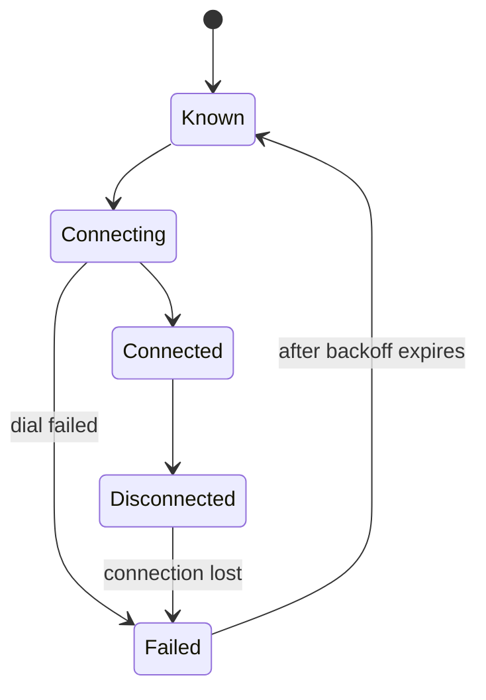

# Peer Dialing Strategy

Design notes for peer discovery, bootstrapping, and connection retry logic.

## Goals

1. **Fast bootstrapping**: Connect to the network quickly on startup
2. **Resilient retry**: Do not give up on peers that temporarily reject us
3. **Efficient resource use**: Do not waste bandwidth on peers unlikely to accept
4. **Bin coverage**: Maintain Kademlia bin targets for proper routing

## Why Peers Reject Connections

A peer disconnecting or refusing a connection does not mean they are bad:

| Reason | Action |
|--------|--------|
| Peer is full (connection limit) | Retry later with backoff |
| Transient network issue | Retry later with backoff |
| Peer is restarting | Retry later with backoff |
| Protocol mismatch | Mark as incompatible, deprioritize |
| Peer banned us | Stop retrying (if detectable) |
| Peer offline permanently | Eventually prune after many failures |

**Key insight**: Most rejections are temporary. Aggressive deletion loses valuable peer knowledge.

## Connection States

## Dial Tracking Fields

The `PeerState` struct should include the following dial tracking fields:

| Field | Type | Description |
|-------|------|-------------|
| `last_dial_attempt` | `Option<Instant>` | When we last attempted to dial this peer |
| `consecutive_failures` | `u32` | Consecutive dial failures; reset on success |
| `total_dial_attempts` | `u64` | Total lifetime dial attempts |
| `total_connections` | `u64` | Total lifetime successful connections |
| `last_connected` | `Option<Instant>` | Last successful connection time |

## Exponential Backoff

After a failed dial, wait before retrying. The delay is calculated as the minimum of `base_delay * 2^consecutive_failures` and `max_delay`, where `base_delay` is 30 seconds and `max_delay` is 1 hour.

| Failures | Delay |
|----------|-------|
| 0 | 0 (first attempt) |
| 1 | 30s |
| 2 | 1m |
| 3 | 2m |
| 4 | 4m |
| 5 | 8m |
| 6 | 16m |
| 7+ | 1h (capped) |

**Jitter**: Add random jitter (0-25% of delay) to prevent thundering herd.

## Dial Candidate Selection

When Kademlia needs connections for a bin, candidates are selected by filtering known peers for dialability and backoff expiry, then sorting by priority, and taking up to a maximum number of candidates.

The backoff check is straightforward: if a peer has never been dialled, it is immediately eligible. Otherwise, the elapsed time since the last attempt must exceed the calculated backoff delay.

The priority ordering (highest priority first) is:

| Priority | Criterion |
|----------|-----------|
| 1 | Never attempted (newest discoveries first for freshness) |
| 2 | Previously connected (proven to work) |
| 3 | Fewer consecutive failures |
| 4 | Longer since last attempt (LRU) |

## Bootstrapping Strategy

### Phase 1: Bootnode Connection

1. Dial bootnodes in parallel (configured list)
2. Stop after reaching `min_bootnode_connections` (default: 3)
3. Do not wait for slow bootnodes; move on after first success

### Phase 2: Hive Discovery

1. Connected peers send us their known peers via Hive protocol
2. Store dialable peers in PeerManager with multiaddrs
3. Add stored overlays to Kademlia (only those we can actually dial)
4. Kademlia evaluates which bins need filling

### Phase 3: Bin Filling

1. Kademlia identifies bins below target (e.g., < 4 connected)
2. For each underfilled bin, select dial candidates (respecting backoff)
3. Dial candidates, update tracking on success/failure
4. TopologyBehaviour initiates dials after evaluating connection candidates

### Continuous Maintenance

After initial bootstrap:

1. **Periodic evaluation**: Kademlia's manage loop checks bin health
2. **Event-driven dialing**: New hive peers trigger immediate evaluation
3. **Backoff expiry**: Peers become dialable again after backoff
4. **Connection churn**: Disconnections trigger replacement searches

## Pruning Strategy

Peers should not be deleted aggressively. A peer is a candidate for pruning only when all of the following conditions are met: it has not been connected in the last 24 hours, it has at least 10 consecutive failures, it has never had a successful connection, and it was discovered more than 7 days ago.

**Rationale**: A peer we connected to yesterday might be temporarily offline. A peer we discovered a week ago and never successfully connected to is likely invalid.

## Metrics to Track

| Metric | Purpose |
|--------|---------|
| `peer_dial_attempts_total` | Total dial attempts (label: result) |
| `peer_dial_backoff_seconds` | Histogram of backoff durations |
| `peer_consecutive_failures` | Histogram of failure counts |
| `kademlia_bin_fill_ratio` | Connected/target per bin |
| `peer_store_size` | Total known peers |
| `peer_dialable_count` | Peers eligible for dialing now |
