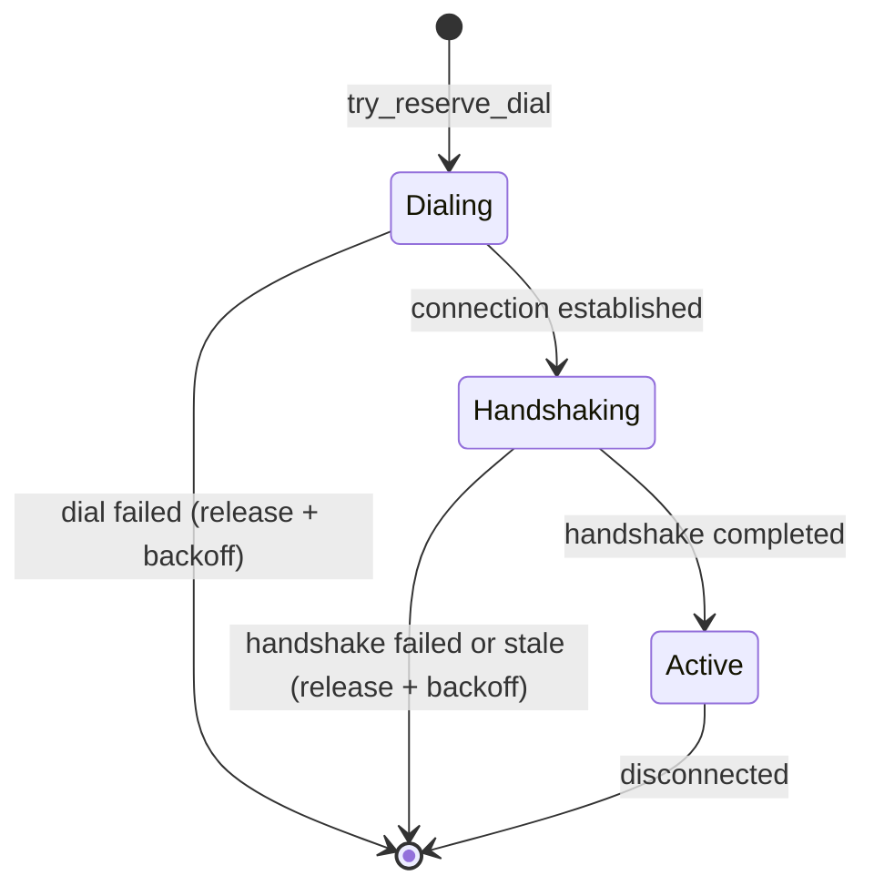

# Peer Dialing Strategy

How `vertex-swarm-topology` decides which peers to dial, how many connections each Kademlia bin holds, and how neighborhood depth and connection allocation stay coupled.

The components involved:

| Component | Crate | Role |
|---|---|---|
| `DepthAwareLimits` | `vertex-swarm-topology` (`kademlia::limits`) | Per-bin connection targets, trim floor, inbound ceiling |
| `KademliaRouting` | `vertex-swarm-topology` (`kademlia::routing`) | Connected-peer table, depth recomputation, phase accounting, eviction candidates |
| Candidate selection | `vertex-swarm-topology` (`kademlia::candidates`) | Picks dialable peers per bin under a per-round budget |
| Routing evaluator | `vertex-swarm-topology` (`kademlia::task`) | Background task that runs evaluation rounds |
| `PeerManager` | `vertex-swarm-peer-manager` | Known-peer table, dialable filtering, ban and backoff state |
| `PeerBackoff` | `vertex-net-peer-backoff` | Exponential dial backoff with per-peer jitter |
| `DialTracker` | `vertex-net-dialer` | In-flight dial tracking and stale-dial cleanup |

Pacing specifics (evaluation cadence, per-round budgets, fixed connection counts) are expected to evolve when per-node-type connection profiles land; this page describes current behaviour only.

## Connection lifecycle

Every outbound connection attempt moves through three phases tracked per bin by `KademliaRouting`:

The capacity question "how full is this bin?" is always answered with the effective count: dialing + handshaking + active. Reserving a `Dialing` slot before the dial starts means a burst of evaluation rounds cannot oversubscribe a bin; the slot is released on every failure path.

Inbound connections reserve no slot until the handshake event is processed, so the inbound admission check (`admission_within_capacity`) adds one to the effective count to model the slot that will be reserved on success. Outbound handshakes already hold a slot, so they check with no adjustment.

## Per-bin allocation

`DepthAwareLimits` is the single source of per-bin numbers. It is stateless: callers pass the depth explicitly. Defaults:

| Constant | Value | Meaning |
|---|---|---|
| `DEFAULT_TOTAL_TARGET` | 160 | Total connected-peer dial budget across balanced bins |
| `DEFAULT_NOMINAL` | 3 | Minimum known peers per bin for depth estimation |
| `DEFAULT_SATURATION_PEERS` (`vertex-swarm-api`) | 8 | Per-bin saturation threshold; floors every balanced-bin target |
| `DEFAULT_BOOTSTRAP_TARGET` | 18 | Per-bin fill target at depth 0; also the trim floor and minimum inbound ceiling |
| `DEFAULT_INBOUND_HEADROOM` | 4 | Inbound slots accepted above a bin's dial target |

`DepthAwareLimits::target(bin, depth)` returns the dial target for a bin:

- **Depth 0 (bootstrap):** every bin fills toward `bootstrap_target.max(saturation)`. No neighborhood is established yet, so all bins are filled aggressively to push them past the saturation frontier and let depth climb. The target is bounded (not unlimited) so a node that has not yet established a neighborhood cannot be flooded.
- **Neighborhood bins (`depth.contains(bin)`):** `usize::MAX`. The node connects to every available peer inside its neighborhood.
- **Balanced bins (below depth):** a linear taper. Bin `i` gets weight `i + 1` out of a weight sum of `depth * (depth + 1) / 2`, applied to `total_target`, so deeper bins (scarcer, more valuable for routing) get more of the budget. The result is floored at `max(nominal, saturation)`.

The saturation floor is the depth-coupling invariant: depth is capped by the shallowest bin below saturation, so any allocation target below saturation would pin depth at that bin forever. The floor is structural inside `target()`, so no configuration can produce a deadlocking target.

Around the dial target sit two more levels, forming a per-bin band:

- `ceiling(bin, depth)` = `max(target + inbound_headroom, bootstrap_target)`. Inbound connections are accepted while the effective count is below this. Shallow bins whose dial target sits at the saturation floor still accept inbound up to the bootstrap level, so churn erodes them toward `bootstrap_target` rather than toward the depth frontier.
- `surplus(bin, depth, connected)` = `connected - max(target, bootstrap_target)`, clamped at zero. Trimming reclaims peers only above this floor. The taper target is a dial goal, not an eviction bound: evicting down to it after a depth increase would cut shallow bins below saturation and immediately collapse depth back to the cut bin.

In short: dial toward `max(taper, saturation)`, accept inbound up to `max(target + headroom, bootstrap_target)`, trim only above `max(target, bootstrap_target)`. Neighborhood bins are unbounded at every level and never produce trim surplus.

## Depth recomputation

`KademliaRouting::recalc_depth` runs on every connect and disconnect. It feeds the connected-peer bin sizes to `nectar_primitives::recompute_neighborhood_depth`, which walks bins shallow to deep to find the unsaturated frontier and anchors the neighborhood by the low watermark (`SwarmSpec::neighborhood_low_watermark`, default 3 from `DEFAULT_NEIGHBORHOOD_LOW_WATERMARK` in `vertex-swarm-api`). A gap below the deepest populated bin pulls depth shallower rather than reporting a too-deep neighborhood.

The saturation argument comes from `DepthAwareLimits::saturation()`, not read separately from the spec, so the depth frontier and the allocation floors can never disagree on any construction path. Production threads `SwarmSpec::saturation_peers()` into the limits once, at behaviour construction.

For candidate selection (not for the reported depth), evaluation uses an effective depth: the maximum of the connected depth and a depth estimated from the known-peer table (the highest bin holding at least `nominal` known peers). This lets a bootstrapping node allocate as if its neighborhood were already established once it knows enough peers, instead of dialing every bin flat.

## Candidate selection

The background evaluator runs `KademliaRouting::evaluate_connections`. Each round:

1. Captures a `CandidateSnapshot`: the limits at the effective depth, the set of peers currently in a connection phase, and the set already queued for dialing. Ban and backoff status are checked live against the `PeerManager` rather than snapshotted.
2. Creates a `CandidateSelector` with a budget of `max_neighbor_candidates + max_balanced_candidates` (16 + 16 by default, set in `KademliaConfig`), roughly one slot per bin so a single round can make progress everywhere without flooding the dialer.
3. `select_neighborhood_candidates` runs first: it walks neighborhood bins from the highest proximity order down to depth, skipping bins that do not need more peers.
4. `select_balanced_candidates` runs on the remaining budget: it computes each balanced bin's deficit against its target, sorts bins by proximity order descending, and fills deficits in that order. At depth 0 it does nothing (the neighborhood pass already covers every bin).

Both passes draw supply from `PeerManager::dialable_overlays_in_bin_excluding`, which filters the known-peer table for peers that are not banned and not in backoff, and additionally excludes overlays the caller is already connected to. The exclusion matters: connected peers are hot in the table and trivially dialable, so without it a bin with more connections than the requested count would yield only already-connected overlays and starve its own refill.

A peer becomes a candidate only if it passes every check: not already connected, not in a connection phase, not already queued, not banned, not in backoff, not a duplicate within the round, and its bin still needs more peers counting candidates already selected this round (`needs_more` against effective count plus per-bin selections).

Selected candidates land in per-bin queues (`CandidateQueues`, bounded per bin) and are drained by the behaviour's poll loop, which resolves them to full peer records, filters by advertisability, and dials them with `DialReason::Discovery`.

## Dialing and pacing

The routing evaluator (`kademlia::task`) is a background task woken two ways:

- A periodic tick every 5 seconds.
- A debounced trigger (`RoutingEvaluatorHandle::trigger_evaluation`, 100 ms debounce) fired when capacity or supply changes: a handshake completes, a connection closes, a gossiped peer passes verification, or the node's network capability becomes known from its first listen address.

The behaviour's poll loop runs its own tick at `DEFAULT_DIAL_INTERVAL` (5 seconds), which also triggers an evaluation round.

Before a dial is issued, `RoutingCapacity::try_reserve_dial` must succeed: it refuses peers already in a connection phase and bins that no longer need more peers at the current depth. The reservation is released on every failure path. A dial failure is additionally recorded against backoff when the attempt actually failed (no reachable addresses, transport-level dial failure, handshake failure, or staleness), but not when dispatch merely skipped the peer (already tracked, or in backoff or banned at dispatch time).

In-flight dials are tracked by `DialTracker` (`vertex-net-dialer`), whose pending TTL and in-flight timeout both reuse `vertex_swarm_net_handshake::HANDSHAKE_TIMEOUT` (15 seconds, the bound on the whole handshake exchange). The behaviour's periodic tick sweeps stale dials and stale pending handshakes, releasing their capacity slots and recording dial failures.

Bootstrap is not a special mode of the evaluator: bootnodes and trusted peers from configuration are dialed directly at startup (with dnsaddr resolution where needed) as `DialTarget::Unknown`, since their overlay addresses are not yet known and no capacity reservation applies. Everything after that first contact flows through gossip supply and the evaluation loop above.

## Connection profiles and dial-rate shaping

How aggressively the node builds out its table is bundled into a named connection profile (`aggressive`, `balanced`, `conservative`), selected by node type (client defaults to `aggressive`, storer and bootnode to `balanced`) and overridable with `--network.connection-profile`. A profile only sets numbers on existing knobs: the evaluation cadence, the per-evaluation candidate budgets, the bootstrap fill level, the dial-concurrency cap, and the discovery dial-rate quota. No topology logic branches on the profile.

Discovery dials are not issued as fixed per-tick batches. The evaluator refreshes per-bin candidate queues on its cadence (and immediately on triggers such as gossip influx), and the dial pipeline drains those queues through a GCRA token bucket:

| Profile | Evaluation interval | Candidate budget (neighbor + balanced) | Dial rate (burst / sustained) | Bootstrap fill |
|---------|---------------------|----------------------------------------|-------------------------------|----------------|
| aggressive | 2s | 24 + 24 | 32 / 12.8 per s | 24 |
| balanced | 5s | 16 + 16 | 32 / 6.4 per s | 18 |
| conservative | 10s | 8 + 8 | 8 / 0.8 per s | 12 |

A burst of fresh candidates (typically right after a gossip exchange) is dialed immediately up to the bucket size; beyond that, candidates stay queued and a timer resumes the drain as soon as a token replenishes, so the node neither hammers the network after an influx nor waits a full evaluation interval to use newly arrived supply. Bootnode dials, trusted-peer dials, and explicit dial commands bypass the bucket.

The bootstrap fill level is floored at the spec saturation threshold inside the depth-aware limits, so no profile can configure a fill too low for the depth climb. The profile bundle is also the intended home for future pacing knobs (for example per-protocol timeout tuning).

## Backoff

Dial backoff lives in `PeerBackoff` (`vertex-net-peer-backoff`) and is tracked per peer by the `PeerManager`:

- Exponential: `base * 2^(failures - 1)`, base 30 seconds (`PeerBackoff::DEFAULT_BASE_SECS`), capped at 1 hour (`PeerBackoff::DEFAULT_MAX_SECS`).
- Deterministic per-peer jitter of +/-25%, seeded from the peer so the same peer always gets the same factor while different peers spread their retries.
- Reset on a successful handshake; re-armed when a fresh connection disconnects early (the success would otherwise have cleared it) and when scoring crosses the disconnect threshold.
- Runtime-only: backoff state, like scores and bans, never survives a restart (see [Peer Management](peer-management.md)).

A peer in backoff is excluded from the dialable supply, so candidate selection never has to re-check it.

## Trimming and eviction

When depth increases, balanced bins that were filled under the previous depth's larger targets may now exceed their band. Both depth-change sites (handshake completion in the protocol handlers and connection close in the connection handlers) call `trim_overpopulated_bins` only when the new depth is strictly greater than the old.

`KademliaRouting::eviction_candidates` computes each balanced bin's surplus from its evictable population only: handshaking plus active connections, excluding in-flight dials. A dial holds a capacity slot but cannot be evicted; counting it into the surplus would force active evictions to pay for slots the evictable population does not own, cutting the bin below saturation and flapping depth. Neighborhood bins never produce candidates.

Victims are chosen per bin in order:

1. Handshaking peers first; they are not yet established.
2. Active peers ranked lowest first by a caller-supplied rank, with ties broken by lowest peer score. The topology behaviour ranks by `(reachability, is_local)`: least-reachable peers go first, and when local-peer trust is enabled a same-subnet peer outranks a remote peer of equal reachability without ever overriding a liveness demotion.

Explicitly configured (trusted) peers are never evicted. Evicted overlays are marked so their disconnect is attributed to bin trimming rather than peer misbehaviour, which exempts them from the early-disconnect score penalty.

## Gossip-driven supply

The known-peer table that candidate selection draws from is fed by hive gossip. Peers learned through gossip are untrusted until a verification handshake on a separate lightweight swarm confirms their identity; only verified peers are stored in the `PeerManager`, and each newly verified peer triggers an evaluation round so fresh supply is considered immediately. The verification pipeline has its own admission caps, backoff, and ban damping, separate from the dial backoff described above.

See [Hive Gossip Strategy](../swarm/hive-gossip.md) for the gossip rules, triggers, and configuration.

## Metrics

The dialing path emits, among others:

| Metric | Purpose |
|---|---|
| `topology_phase_transitions_total` | Connection phase transitions, labelled `from`/`to` |
| `topology_dial_failures_total` | Dial failures, labelled by reason and error type |
| `topology_depth` plus `topology_depth_{increases,decreases}_total` | Depth value and change direction |
| `topology_bin_{connected_peers,known_peers,dialing,handshaking,active,effective}` | Per-bin populations, labelled `po`, pushed on connect/disconnect |

Readiness questions ("am I saturated yet?") are answered by the deterministic readiness surface on `TopologyHandle`, which snapshots exact counts from the routing table rather than metrics.
