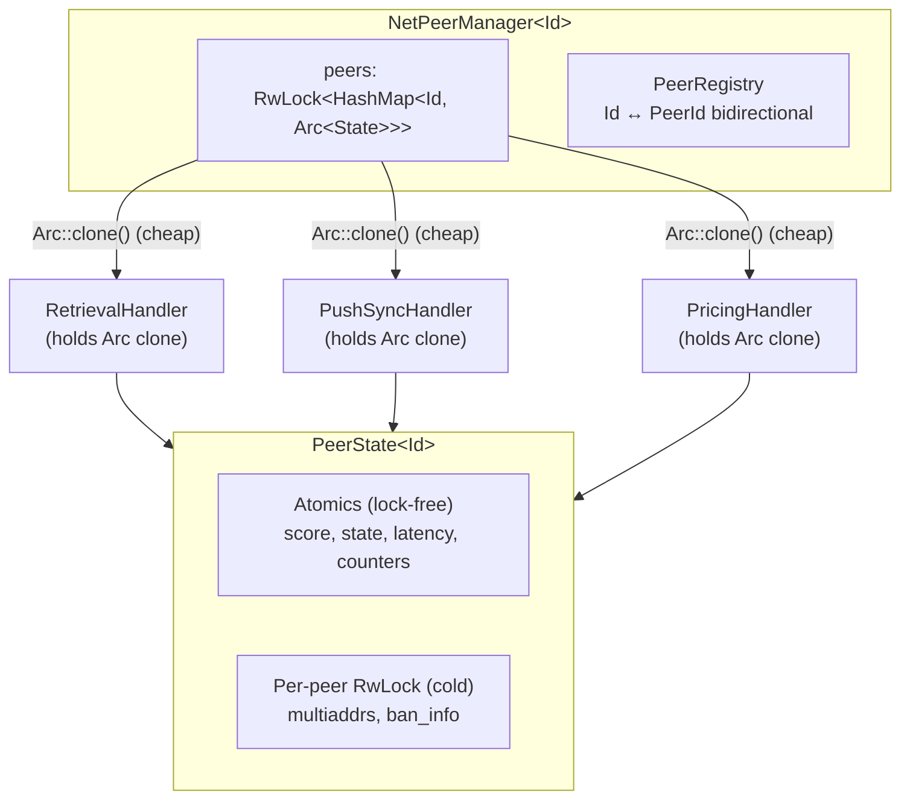

# Peer Management

Protocol-agnostic peer state management with Arc-per-peer pattern.

## Crate Structure

Peer management is split across four crates:

| Crate | Responsibility |
|-------|---------------|
| `vertex-net-peer-registry` | Bidirectional Id ↔ PeerId mapping, peer registration lifecycle |
| `vertex-net-peer-store` | Peer persistence (snapshot save/load, memory and file backends) |
| `vertex-net-peer-score` | Atomic peer scoring with fixed-point arithmetic |
| `vertex-net-peer-backoff` | Exponential backoff for failed connections |

All crates are protocol-agnostic and operate below the Swarm layer.

## Architecture

## Arc-per-Peer Pattern

The core design principle: protocol handlers get `Arc<PeerState>` once, then all subsequent operations are lock-free (atomics) or per-peer locked (no global contention).

### Lock Contention Analysis

| Operation | Lock | Contention |
|-----------|------|------------|
| Get peer Arc | Global map read | Brief, amortised by caching Arc |
| Create new peer | Global map write | Rare (once per peer lifetime) |
| Score update | None (atomic) | Zero |
| State check | None (atomic) | Zero |
| Latency update | None (atomic) | Zero |
| Multiaddr update | Per-peer RwLock | Zero with other peers |
| Connected peers list | Global map read | Brief iteration |

## Core Types

### NetPeerId (Blanket Trait)

Any type implementing `Clone + Eq + Hash + Send + Sync + Debug + Serialize + Deserialize` automatically implements `NetPeerId`. No explicit implementation needed.

### PeerState

Per-peer state with atomic hot paths and per-peer locked cold paths.

**Atomic fields (hot path):** score, connection state, latency, connection counters, last-seen timestamp, node type (a write-once-confirmed cell: gossip sets a provisional value, the handshake confirms it, and only a later handshake can change it).

**Locked fields (cold path):** peer record (multiaddrs), ban metadata.

### ConnectionState

| State | Meaning |
|-------|---------|
| `Known` | Discovered but not connected |
| `Connecting` | Dial in progress |
| `Connected` | Handshake complete |
| `Disconnected` | Was connected, may reconnect |
| `Banned` | Will not reconnect |

### PeerRegistry

Bidirectional mapping between protocol IDs (e.g., `OverlayAddress`) and libp2p `PeerId`.

Handles:
- Peer reconnection with different PeerId (returns `RegisterResult::Replaced`)
- Same peer, same PeerId reconnection (returns `RegisterResult::SamePeer`)
- Peer changing overlay address (old mapping removed)

### Peer lifecycle events

The Swarm-layer peer manager (`vertex-swarm-peer-manager`) is the authoritative peer hub. It broadcasts `PeerLifecycleEvent` (defined in `vertex-swarm-api`) on a non-blocking channel; any subsystem can subscribe via the manager handle.

Events: `Connected`, `Disconnected`, `ScoreWarning`, `DisconnectRequested`, `Banned`, `Unbanned`.

Two invariants hold around this stream:

- **One way to change a score.** Every subsystem reports peer behaviour through the `PeerReporter` trait (`report_peer(overlay, event, source)`), implemented by the peer manager. The manager applies the event, checks the warn/disconnect/ban thresholds, and emits the matching lifecycle event itself. Nothing else mutates scores.
- **Topology executes the actions.** Topology subscribes and closes connections for `DisconnectRequested` and `Banned`; all other events are observability-only for it. Disconnect execution is owned by topology, never by the manager.

Slow subscribers drop the oldest events independently (no backpressure on other subscribers). Observability subscribers tolerate the gap; topology treats a lagged receiver as a resynchronization point and sweeps connected peers against the banned set, so a dropped `Banned` event can never leave a banned peer connected. A `DisconnectRequested` lost to lag is not replayed; continued misbehaviour escalates to the level-triggered ban threshold, which is reconciled exactly.

## Persistence

The `NetPeerStore` trait provides snapshot-based persistence with `load_all`, `save`, `save_batch`, `remove`, `get`, `count`, `clear`, and `flush` operations. Auto-impl provided for `&T`, `Box<T>`, `Arc<T>`.

| Store | Use Case |
|-------|----------|
| `MemoryPeerStore` | Testing, no persistence |
| `FilePeerStore` | JSON file, atomic writes via temp file + rename |

## Scoring

Score is maintained atomically using fixed-point arithmetic (scaled by 100,000). Clamped to [-1,000,000, +1,000,000].

Default score adjustments:
- `record_success()`: +1.0
- `record_timeout()`: -1.5
- `record_protocol_error()`: -3.0

Custom adjustments via `add_score(delta)` or `set_score(value)`.

## Thread Safety

All types are `Send + Sync`. The design ensures:

1. **Global map lock** held briefly to get `Arc<PeerState>`
2. **No global lock** needed after obtaining the Arc
3. **Per-peer RwLock** only contends with same-peer operations
4. **Atomics** for all hot-path operations (score, state, counters)

Protocol handlers should cache the `Arc<PeerState>` to avoid repeated map lookups.

## See Also

- [Address Management](address-management.md) - Address classification and NAT
