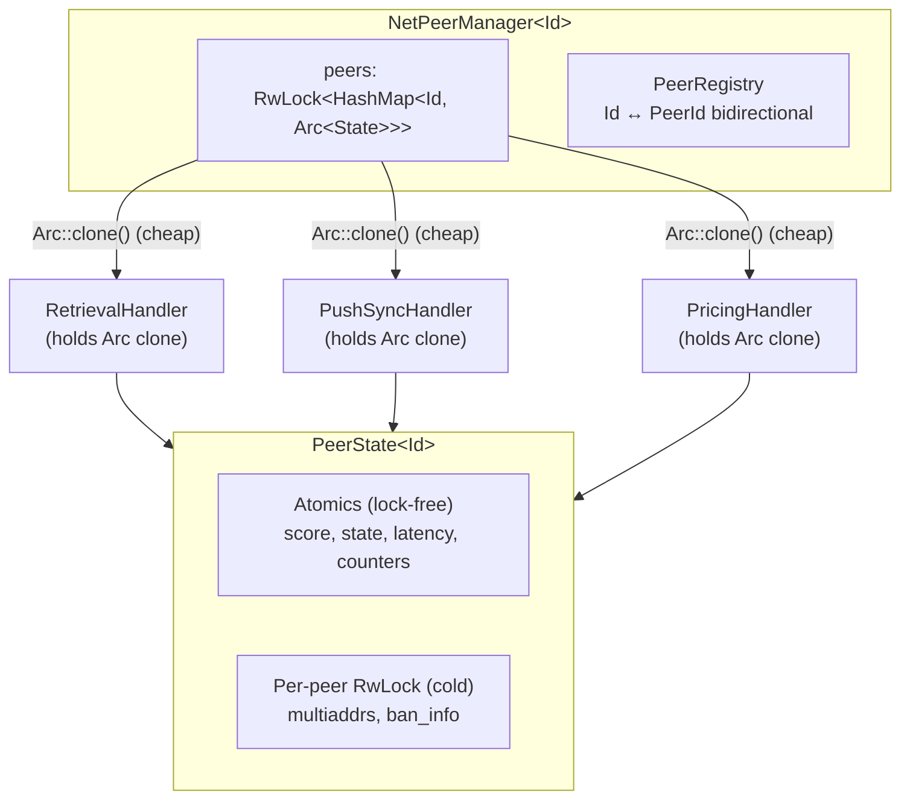

# Peer Management

Protocol-agnostic peer state management with Arc-per-peer pattern.

## Crate Structure

Peer management is split across four crates:

| Crate | Responsibility |
|-------|---------------|
| `vertex-net-peer-registry` | Bidirectional Id ↔ PeerId mapping, peer registration lifecycle |
| `vertex-net-peer-store` | Identity-only snapshot persistence (`PeerSnapshotStore`: load once, full-replace store) |
| `vertex-net-peer-score` | Atomic peer scoring with fixed-point arithmetic |
| `vertex-net-peer-backoff` | Exponential backoff for failed connections |

All crates are protocol-agnostic and operate below the Swarm layer.

## Architecture

## Arc-per-Peer Pattern

The core design principle: protocol handlers get `Arc<PeerState>` once, then all subsequent operations are lock-free (atomics) or per-peer locked (no global contention).

### Lock Contention Analysis

| Operation | Lock | Contention |
|-----------|------|------------|
| Get peer Arc | Global map read | Brief, amortised by caching Arc |
| Create new peer | Global map write | Rare (once per peer lifetime) |
| Score update | None (atomic) | Zero |
| State check | None (atomic) | Zero |
| Latency update | None (atomic) | Zero |
| Multiaddr update | Per-peer RwLock | Zero with other peers |
| Connected peers list | Global map read | Brief iteration |

## Core Types

### NetPeerId (Blanket Trait)

Any type implementing `Clone + Eq + Hash + Send + Sync + Debug + Serialize + Deserialize` automatically implements `NetPeerId`. No explicit implementation needed.

### PeerState

Per-peer state with atomic hot paths and per-peer locked cold paths.

**Atomic fields (hot path):** score, connection state, latency, connection counters, last-seen timestamp, node type (a write-once-confirmed cell: gossip sets a provisional value, the handshake confirms it, and only a later handshake can change it), verified bit (gossip-admitted entries start unverified; the first completed handshake flips it and gossip can never clear it).

**Locked fields (cold path):** peer record (multiaddrs), ban metadata.

### ConnectionState

| State | Meaning |
|-------|---------|
| `Known` | Discovered but not connected |
| `Connecting` | Dial in progress |
| `Connected` | Handshake complete |
| `Disconnected` | Was connected, may reconnect |
| `Banned` | Will not reconnect |

### PeerRegistry

Bidirectional mapping between protocol IDs (e.g., `OverlayAddress`) and libp2p `PeerId`.

Handles:
- Peer reconnection with different PeerId (returns `RegisterResult::Replaced`)
- Same peer, same PeerId reconnection (returns `RegisterResult::SamePeer`)
- Peer changing overlay address (old mapping removed)

### Peer lifecycle events

The Swarm-layer peer manager (`vertex-swarm-peer-manager`) is the authoritative peer hub. It broadcasts `PeerLifecycleEvent` (defined in `vertex-swarm-api`) on a non-blocking channel; any subsystem can subscribe via the manager handle.

Events: `Connected`, `Disconnected`, `ScoreWarning`, `DisconnectRequested`, `Banned`, `Unbanned`.

Two invariants hold around this stream:

- **One way to change a score.** Every subsystem reports peer behaviour through the `PeerReporter` trait (`report_peer(overlay, event, source)`), implemented by the peer manager. The manager applies the event, checks the warn/disconnect/ban thresholds, and emits the matching lifecycle event itself. Nothing else mutates scores.
- **Topology executes the actions.** Topology subscribes and closes connections for `DisconnectRequested` and `Banned`; all other events are observability-only for it. Disconnect execution is owned by topology, never by the manager.

Slow subscribers drop the oldest events independently (no backpressure on other subscribers). Observability subscribers tolerate the gap; topology treats a lagged receiver as a resynchronization point and sweeps connected peers against the banned set, so a dropped `Banned` event can never leave a banned peer connected. A `DisconnectRequested` lost to lag is not replayed; continued misbehaviour escalates to the level-triggered ban threshold, which is reconciled exactly.

## In-memory peer set

The Swarm-layer peer manager (`vertex-swarm-peer-manager`) holds the entire known peer set in memory: one `DashMap` of peer entries, with a `ProximityIndex` as a pure bin-membership index over it. At the default cap of 128 peers per bin this is a few MB of RAM, so there is no hot/cold split and no on-demand loading; every query is served from memory.

The per-bin cap is enforced at admission time. When a bin is full and a new peer is discovered, the manager replaces the worst disconnected record (stale entries first, then lowest score). Connected peers are never evicted by admission; if every slot in the bin is held by a connected peer, the newcomer is rejected.

### Unverified tier: verify on first dial

Records admitted via hive gossip enter the table **unverified**: the record's signature was validated at the protocol layer, but no connection has ever confirmed that the multiaddrs actually belong to the claimed overlay. Unverified entries are fully dialable and feed candidate selection like any other supply; the first completed handshake on a real connection flips the entry to verified in the same round trip (`on_peer_connected`), so verification costs no extra handshake and no separate prober identity. There is no ranking preference between verified and unverified candidates; selection stays bin-driven.

The verified bit shapes two policies:

- **Stale budget.** A peer with consecutive dial failures is purged by the tick once it exhausts its failure budget: 3 failures for unverified entries (a gossip claim gets a short audition), 48 for once-verified peers. This keeps junk gossip from polluting candidate supply while letting a flaky known-good peer ride out an outage.
- **Snapshot scope.** Only verified entries are written to the peer snapshot, so persisted records always carry first-hand identity evidence. The bit itself still resets on restart (like the node-type confirmed bit): restored entries are dialable immediately and re-earn verification on their next handshake.

If a dial guided by a stored record completes a handshake asserting a *different* overlay, topology calls `on_dialed_overlay_mismatch`: an unverified record is removed outright (the claim was wrong), while a once-verified record takes a dial failure so backoff and the stale purge retire it if its addresses now consistently reach someone else. The peer that actually answered is stored and verified through the normal connection path.

## Persistence

Persistence is an opt-in, identity-only snapshot over the shared node database, which is in-memory by default: without `--db.persist` or `--db.path` no snapshot store exists and the peer set lives purely in memory. The `PeerSnapshotStore` trait (`vertex-net-peer-store`) has exactly two operations: `load` (once, at startup) and `store` (full replace of the persisted set in one transaction). Auto-impl provided for `&T`, `Box<T>`, `Arc<T>`.

| Store | Use Case |
|-------|----------|
| `MemoryPeerStore` | Testing, no persistence |
| `DbPeerSnapshotStore` | Snapshot table over the shared database (`vertex-swarm-peer-manager`) |

The persisted record (`PeerSnapshot`) carries only the signed peer record, the last known node type, and a last-seen timestamp, and is written only for verified entries (see the unverified tier above). Reputation never survives a restart: scores, bans, dial backoff, and the verified bit are runtime-only and the banned set starts empty on every startup. Bans are timed and re-earned within seconds of a misbehaving peer reconnecting, so persisting them buys nothing.

Snapshots are written by `PeerManager::tick`, the single periodic maintenance entry point (every tick: score decay, ban expiry, stale-peer purge; snapshot only when due). The manager owns no timers; a thin driver (`spawn_peer_manager_task`) is spawned from the node launch path, and topology writes a final snapshot on graceful shutdown. Crash-loss story: a crash loses at most one snapshot interval (default 5 minutes) of newly discovered peers, which rediscovery via bootnodes and hive gossip replaces quickly.

## Scoring

Each peer's score is one atomic `f64` clamped to [-100, +100], owned by `vertex-net-peer-score` and wrapped with the Swarm threshold policy in `vertex-swarm-peer-score`. Every subsystem reports behaviour through `PeerManager::report_peer` (the `PeerReporter` trait); event weights are configured in `SwarmScoringConfig`.

Default thresholds: warn at -50 (peer excluded from selection, `ScoreWarning` emitted once per descent), disconnect at -75 (`DisconnectRequested` plus dial backoff, edge-triggered), ban at -100 (timed ban, level-triggered).

### Lifecycle: decay, recovery, timed bans

All lifecycle maintenance runs from `PeerManager::tick`, driven by the external periodic task; the manager owns no timers and `tick` takes the current unix time as a parameter.

- **Decay.** Every tick, each peer's score decays exponentially toward zero: half-life 10 minutes while disconnected, 5 minutes while connected (double rate, so a connected peer that behaves recovers reputation twice as fast). Both positive and negative scores decay; reputation is recency-weighted in both directions. Elapsed time is tracked per peer, so a delayed or missed tick decays by the true elapsed time on the next run.
- **Recovery.** When a decayed score climbs back above the warn threshold, the one-shot warning re-arms: a peer that recovers and then misbehaves again is warned again.
- **Timed bans.** A ban lasts `PeerManagerConfig::ban_duration` (default 12 hours); the `Banned` lifecycle event carries the expiry as `until`. When the expiry passes, `tick` lifts the ban, emits `Unbanned` exactly once, and resets the score to the disconnect threshold: an unbanned peer must behave to climb back, it is not forgiven to neutral. Re-banning an already banned peer is a no-op (the original expiry stands), and score reports for banned peers are dropped entirely, so a repeat offender on a lingering stream can neither re-emit `Banned` nor extend its ban. Repeated offenders currently get the same fixed duration on each new ban; escalating durations are a possible follow-up.
- **Permanent bans.** `PeerManager::ban_permanent` sets no expiry and the tick never lifts it. It is reserved for operator-initiated bans; the operator surface that calls it arrives with the gRPC work. All bans, timed or permanent, are runtime-only and cleared by a restart.

## IP association tracking

The peer manager tracks which remote IP each handshake-completed connection came from to detect identity cycling: an attacker that keeps one IP but rotates nonces (and therefore overlay addresses) to shed bans and reputation. Topology records the connection's remote IP at establishment and passes it to `on_peer_connected`; gossiped or self-asserted addresses are never used.

Sightings are grouped per exact IPv4 address and per IPv6 /64 prefix (the standard end-site allocation, so one host cannot evade the cap by rotating interface identifiers). Each group holds a bounded deque of `(overlay, seen_at)` sightings with a sliding window, and a reverse index maps each overlay to its groups so removal from the peer set cleans the tracker in O(1) without scanning. Stale-peer purges in `PeerManager::tick` and admission replacements both flow through this cleanup.

When the number of distinct overlays seen from one group within the window exceeds the configured cap (`IpTrackerConfig`, default 16 in 15 minutes), each further NEW overlay from that group is reported through the single scoring path as `RateLimitExceeded`. The response is deliberately score-based rather than an outright ban: a shared IPv4 address (CGNAT, campus NAT) can front many legitimate peers, and a direct ban would punish the cohort for one abuser. Peers with `TrustLevel::LocalSubnet` or `Trusted` are exempt entirely, so several nodes on one home LAN never trip the detector.

Consumers can query the tracker through `PeerManager::overlays_seen_from_ip` and `PeerManager::ip_cycling_suspected`; the planned inbound handshake rate limiter uses these to throttle signature-recovery work for suspect source IPs. Observability: the `peer_manager_tracked_ips` gauge and the `peer_manager_ip_cycling_detections_total` counter.

## Transport connection limits

The swarm composes `libp2p::connection_limits` into every node-type behaviour (bootnode, client, storer) as a transport-level backstop, enforced before any other behaviour allocates per-connection state. The caps, built in `vertex-swarm-node` from the network configuration:

| Limit | Source | Default |
|-------|--------|---------|
| Established total | `--network.max-peers` | 400 |
| Established per peer | constant | 2 |
| Pending incoming | constant | 64 |
| Pending outgoing | constant | 64 |

Division of responsibility: topology owns connection composition (per-bin targets, saturation, inbound ceilings, trimming) and its steady-state totals sit well below the transport cap; the transport cap only bounds resource consumption (file descriptors, memory) when topology accounting is bypassed or overwhelmed. The per-peer cap of 2 tolerates the simultaneous-open race; topology closes duplicate connections itself. The pending-outgoing cap of 64 sits at twice the dialer's 32 concurrent in-flight dials to leave room for bootnode, mDNS, and operator-issued dials.

A dial denied by the limits surfaces to topology as `DialError::Denied` and carries no score penalty: the peer was never contacted, so the failure says nothing about it. The peer still receives normal dial backoff, which paces retries while the cap is exhausted. The hive gossip verifier uses its own short-lived swarm and is not subject to the main swarm's limits.

## Thread Safety

All types are `Send + Sync`. The design ensures:

1. **Global map lock** held briefly to get `Arc<PeerState>`
2. **No global lock** needed after obtaining the Arc
3. **Per-peer RwLock** only contends with same-peer operations
4. **Atomics** for all hot-path operations (score, state, counters)

Protocol handlers should cache the `Arc<PeerState>` to avoid repeated map lookups.

## See Also

- [Address Management](address-management.md) - Address classification and NAT
