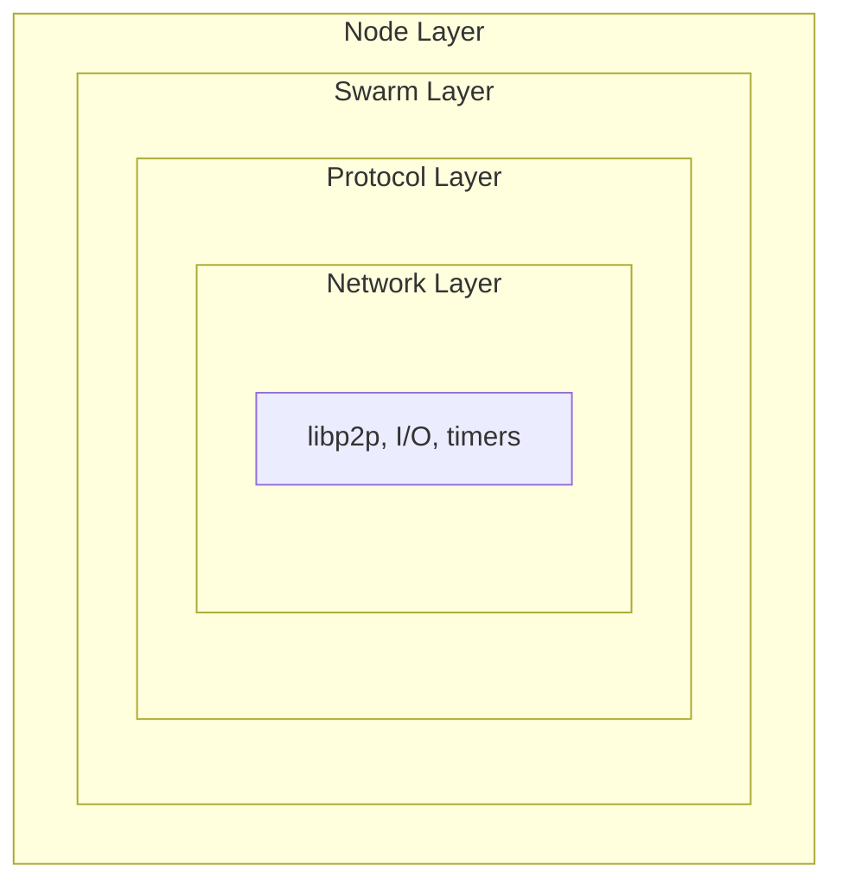

# Observability Design

This document defines the observability methodology for Vertex, covering tracing spans, metrics instrumentation, and boundary decisions for production monitoring.

## Design Principles

1. **Operator-first**: Surface actionable information for node operators
2. **Low overhead**: Instrumentation must not impact hot paths
3. **Consistent naming**: Follow conventions for metrics and span names
4. **Bounded cardinality**: Labels must have finite, predictable values
5. **Layered detail**: Debug-level instrumentation for development, info-level for production

## Three Pillars

| Pillar | Tool | Purpose |
|--------|------|---------|
| **Metrics** | Prometheus (`metrics` crate) | Quantitative health: rates, gauges, histograms |
| **Tracing** | OpenTelemetry (OTLP) | Request flow, latency breakdown, causality |
| **Logging** | `tracing` events | Context-rich diagnostics, errors |

All three share the same `tracing` subscriber infrastructure, enabling trace-to-log correlation via `trace_id`.

## Instrumentation Boundaries

### Layer Boundaries

Instrumentation is placed at **layer transitions** and **external boundaries**:



| Boundary | Span | Metrics | Rationale |
|----------|------|---------|-----------|
| RPC entry | Yes | Yes | Request lifecycle, latency SLOs |
| Protocol exchange (handshake, hive, pushsync, etc.) | Yes | Yes | Per-peer, per-protocol observability |
| Storage operations | Yes | Yes | I/O latency, throughput |
| Topology events | No* | Yes | High-frequency, metrics-only |
| Internal state transitions | No | Selective | Avoid noise |

*Topology events use metrics only to avoid span overhead for high-frequency operations.

### What Gets a Span

Spans track **causally related work** across async boundaries:

| Component | Span Granularity | Example |
|-----------|------------------|---------|
| RPC handler | Per-request | `rpc.upload_chunk` |
| Protocol exchange | Per-exchange | `handshake`, `hive.exchange`, `pushsync.push` |
| Retrieval | Per-chunk | `retrieval.fetch{chunk_addr}` |
| Storage batch | Per-batch | `localstore.put_batch{count}` |

**Do NOT create spans for:**
- Individual message encode/decode
- In-memory cache lookups
- Synchronous, non-blocking operations

### What Gets Metrics

Metrics capture **aggregated state** and **rates**:

| Type | Use Case | Example |
|------|----------|---------|
| Counter | Events over time | `handshake_attempts_total` |
| Gauge | Current state | `topology_connected_peers` |
| Histogram | Latency distributions | `handshake_duration_seconds` |

## Metric Naming Conventions

### Format

Metrics follow the pattern `<component>_<what>_<unit>`.

Examples:
- `topology_connected_peers` (gauge, unitless count)
- `handshake_duration_seconds` (histogram)
- `hive_exchanges_total` (counter)
- `retrieval_bytes_total` (counter)

### Labels

Labels add dimensions but must have **bounded cardinality**:

| Label | Allowed Values | Cardinality |
|-------|----------------|-------------|
| `direction` | `inbound`, `outbound` | 2 |
| `outcome` | `success`, `failure` | 2 |
| `peer_type` | `full`, `light` | 2 |
| `reason` | Error enum variants | ~10-20 |
| `protocol` | Protocol names | ~10 |

**Never use as labels:**
- Peer IDs or overlay addresses (unbounded)
- Chunk references (unbounded)
- Timestamps or durations (use histograms)

### Label Modules

Each metrics module defines labels in a `label` submodule. Label constants are organized by category (e.g., `direction::INBOUND`, `direction::OUTBOUND`, `outcome::SUCCESS`, `outcome::FAILURE`) and exposed as `&str` constants.

## Span Naming Conventions

### Format

Spans follow the pattern `<component>.<operation>`.

Examples:
- `handshake.inbound`
- `hive.exchange`
- `pushsync.push`
- `retrieval.fetch`
- `rpc.bzz.upload`

### Span Fields

Use structured fields for context. Fields use Display format (prefixed with `%`) for human-readable values, Debug format (prefixed with `?`) for complex types, and bare names for numeric values. For example, a retrieval span would carry `chunk_addr` in Display format, `peer_id` in Debug format, and `attempt` as a plain numeric field.

**High-cardinality fields** (peer_id, chunk_addr) are acceptable in span fields because they're stored in trace storage, not metric labels.

## Implementation Patterns

### Pattern 1: Stateful Metrics (Gauges)

For gauges that track current state, use a stateful struct that holds an atomic counter alongside the gauge. Methods such as `record_peer_connected` and `record_peer_disconnected` atomically increment or decrement the counter and then set the gauge to the new value. This ensures the gauge always reflects the true count, even under concurrent updates.

### Pattern 2: Drop-Based Lifecycle Tracking

For operations with a clear start and end, use a struct that records the start time and an "outcome recorded" flag. On construction, increment the attempt counter and active gauge. When the caller explicitly records success, emit the success counter and duration histogram. On drop, decrement the active gauge; if no outcome was recorded, emit a failure counter with reason "unknown". This guarantees cleanup even on early returns or panics.

### Pattern 3: LazyLock for Global Metrics

For cross-cutting concerns (executor, node-level), use `LazyLock<Gauge>` (or `LazyLock<Counter>`, etc.) to lazily initialize global metric handles. The metric is registered with the recorder on first access, avoiding ordering issues with recorder installation.

### Pattern 4: Stateless Event Recording

For fire-and-forget metrics without gauge tracking, use a plain function that matches on an event enum and increments the appropriate counters or records histogram values. No struct or state is needed.

### Pattern 5: Span Instrumentation

For async operations, create an `info_span!` with the appropriate name and fields, then wrap the async block with `.instrument(span)` before awaiting. This propagates the span context through the entire async operation, including across yield points.

## Component Coverage

### Protocol Layer (`net/protocols/*`)

| Protocol | Metrics | Spans | Notes |
|----------|---------|-------|-------|
| Handshake | `handshake_*` | `handshake.{inbound,outbound}` | Per-connection lifecycle |
| Hive | `hive_*` | `hive.exchange` | Peer discovery exchanges |
| PingPong | `pingpong_*` | None | Lightweight, metrics only |
| Pricing | `pricing_*` | `pricing.announce` | Price announcements |
| PushSync | `pushsync_*` | `pushsync.push` | Chunk upload path |
| Retrieval | `retrieval_*` | `retrieval.fetch` | Chunk download path |
| Pseudosettle | `pseudosettle_*` | `pseudosettle.settle` | Settlement operations |
| Swap | `swap_*` | `swap.cashout` | Payment operations |

### Topology Layer (`swarm/topology`)

| Metric | Type | Labels |
|--------|------|--------|
| `topology_connected_peers` | Gauge | `peer_type` |
| `topology_depth` | Gauge | None |
| `topology_connections_total` | Counter | `direction`, `outcome`, `peer_type` |
| `topology_connections_rejected_total` | Counter | `reason`, `direction` |
| `topology_disconnections_total` | Counter | `reason` |
| `topology_dial_failures_total` | Counter | `reason` |
| `topology_handshake_duration_seconds` | Histogram | `peer_type`, `direction` |
| `topology_ping_rtt_seconds` | Histogram | None |

### Task Executor (`tasks`)

| Metric | Type | Labels |
|--------|------|--------|
| `executor.spawn.critical_tasks_total` | Counter | None |
| `executor.spawn.regular_tasks_total` | Counter | None |
| `executor.tasks.running` | Gauge | `type` |
| `executor.tasks.panicked_total` | Counter | `type` |
| `executor.tasks.graceful_shutdown_pending` | Gauge | None |

### Storage Layer (`swarm/localstore`)

| Metric | Type | Labels |
|--------|------|--------|
| `localstore_chunks_total` | Gauge | `type` |
| `localstore_bytes_total` | Gauge | None |
| `localstore_put_duration_seconds` | Histogram | `batch` |
| `localstore_get_duration_seconds` | Histogram | `cache_hit` |
| `localstore_gc_chunks_removed_total` | Counter | None |

### Bandwidth Accounting (`swarm/bandwidth/*`)

| Metric | Type | Labels |
|--------|------|--------|
| `bandwidth_sent_bytes_total` | Counter | `peer_type` |
| `bandwidth_received_bytes_total` | Counter | `peer_type` |
| `bandwidth_balance` | Gauge | None |
| `bandwidth_threshold_disconnects_total` | Counter | None |

## Log Levels

| Level | Audience | Use Case | Examples |
|-------|----------|----------|----------|
| `error!` | Operators | Requires attention | Connection failures, storage errors |
| `warn!` | Operators | Degraded but functional | Peer misbehaviour, retries exhausted |
| `info!` | Operators | State changes | Node started, depth changed, peer connected |
| `debug!` | Developers | Technical details | Message contents, state transitions |
| `trace!` | Developers | Verbose debugging | Every packet, every decision |

### Structured Logging

Always use structured fields rather than interpolated format strings. Pass values as named fields (e.g., `peer = %peer_id, depth = depth`) so they can be indexed and filtered by log aggregation tools.

## Sampling Strategy

### Production Defaults

| Signal | Default | Rationale |
|--------|---------|-----------|
| Metrics | 100% | Lightweight, always needed |
| Traces | 10% | Balance detail vs. storage cost |
| Logs (info+) | 100% | Essential for operations |
| Logs (debug) | Off | Development only |

### Trace Sampling Configuration

```bash
# 10% sampling (production)
vertex node --tracing.sampling-ratio 0.1

# 100% sampling (debugging)
vertex node --tracing.sampling-ratio 1.0
```

## Alerting Guidelines

### SLI/SLO Candidates

| SLI | Target | Alert Threshold |
|-----|--------|-----------------|
| Handshake success rate | 95% | < 90% for 5m |
| Connected peers | >= 4 | < 2 for 10m |
| Storage write latency p99 | < 100ms | > 500ms for 5m |
| Retrieval success rate | 99% | < 95% for 5m |

### Key Metrics for Dashboards

1. **Health**: connected peers, depth, task panics
2. **Throughput**: chunks pushed/retrieved, bytes transferred
3. **Latency**: handshake p50/p99, retrieval p50/p99
4. **Errors**: dial failures, rejections by reason, disconnects by reason

## Local Development Stack

See [Observability Stack](../../observability/README.md) for the Docker Compose setup with Prometheus, Tempo, Loki, and Grafana.
