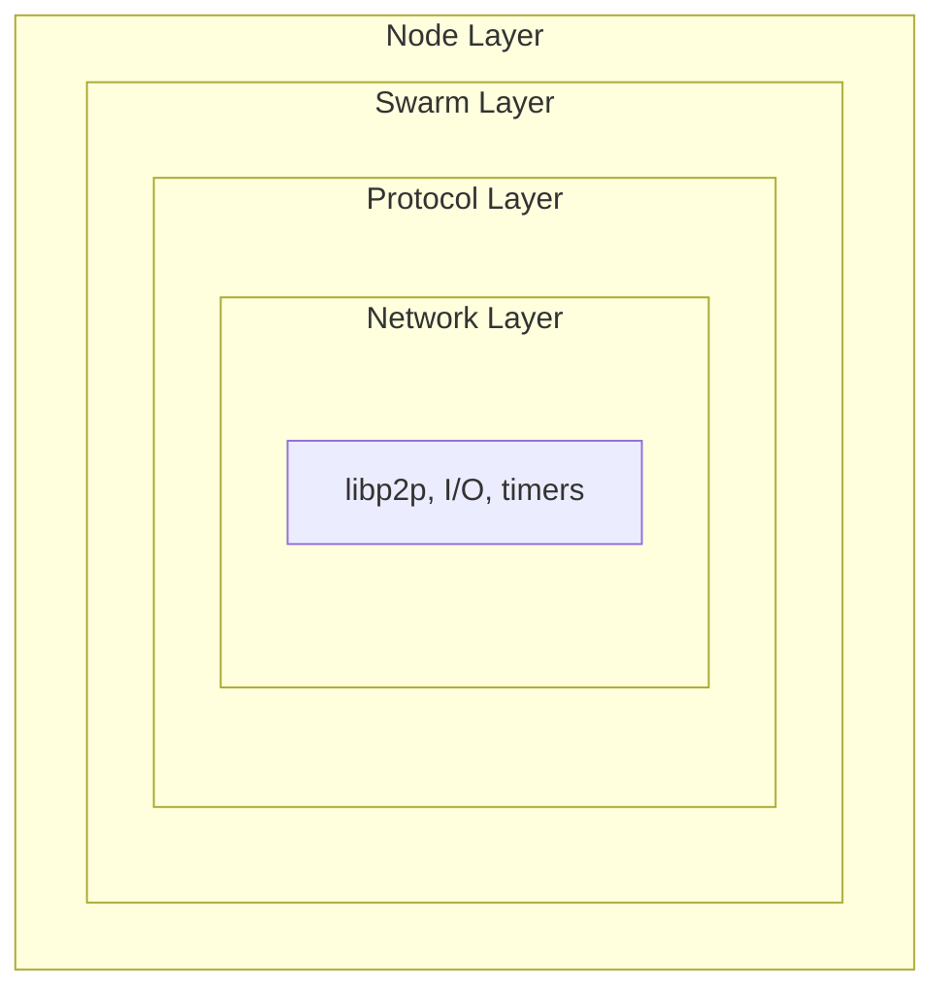

# Observability Design

This document defines the observability methodology for Vertex, covering tracing spans, metrics instrumentation, and boundary decisions for production monitoring.

## Design Principles

1. **Operator-first**: Surface actionable information for node operators
2. **Low overhead**: Instrumentation must not impact hot paths
3. **Consistent naming**: Follow conventions for metrics and span names
4. **Bounded cardinality**: Labels must have finite, predictable values
5. **Layered detail**: Debug-level instrumentation for development, info-level for production

## Three Pillars

| Pillar | Tool | Purpose |
|--------|------|---------|
| **Metrics** | Prometheus (`metrics` crate) | Quantitative health: rates, gauges, histograms |
| **Tracing** | OpenTelemetry (OTLP) | Request flow, latency breakdown, causality |
| **Logging** | `tracing` events | Context-rich diagnostics, errors |

All three share the same `tracing` subscriber infrastructure, enabling trace-to-log correlation via `trace_id`.

## Instrumentation Boundaries

### Layer Boundaries

Instrumentation is placed at **layer transitions** and **external boundaries**:



| Boundary | Span | Metrics | Rationale |
|----------|------|---------|-----------|
| Handshake | Yes | Yes | Per-connection lifecycle, admission control |
| Headered-protocol exchange (hive and any request-response over the header frame) | Yes | Yes | Per-peer, per-protocol observability, trace-context propagation |
| Storage operations | Yes | Yes | I/O latency, throughput |
| Topology events | No* | Yes | High-frequency, metrics-only |
| Internal state transitions | No | Selective | Avoid noise |

*Topology events use metrics only to avoid span overhead for high-frequency operations.

### What Gets a Span

Spans track **causally related work** across async boundaries. The spans that exist today:

| Component | Span Granularity | Span name and fields |
|-----------|------------------|----------------------|
| Handshake | Per-handshake | `handshake` with `direction`, `peer_id`, `remote_addr`, `remote_overlay` (instrumented on `handle_inbound`/`handle_outbound` in `vertex-swarm-net-handshake`) |
| Headered protocol stream | Per-exchange | `protocol` with `protocol`, `direction` (opened in `vertex-swarm-net-headers`, with W3C trace-context inject/extract across the wire on native; the wasm sibling is a no-op) |
| Headered request handling | Per-request | `handle_request` (`vertex-swarm-net-headers`) |
| Storage operation | Per-operation | `db_get`, `db_put`, `db_delete`, `db_clear`, `db_count`, `db_entries`, `db_keys`, `db_commit` (`vertex-storage-redb`) |

There is no RPC, retrieval, or pushsync span yet: those protocol crates carry no instrumentation. Add the span when the protocol lands rather than documenting it ahead of the code.

**Do NOT create spans for:**
- Individual message encode/decode
- In-memory cache lookups
- Synchronous, non-blocking operations

### What Gets Metrics

Metrics capture **aggregated state** and **rates**:

| Type | Use Case | Example |
|------|----------|---------|
| Counter | Events over time | `handshake_total` |
| Gauge | Current state | `topology_connected_peers` |
| Histogram | Latency distributions | `handshake_duration_seconds` |

## Metric Naming Conventions

### Format

Metrics follow the pattern `<component>_<what>_<unit>`. Every family is prefixed with `vertex_` on export (the prefix is set by `--metrics.prefix`, default `vertex`, applied by a `PrefixLayer` so it covers application, `process_*`, and `executor_*` families alike). The names in this document are written without that prefix.

Examples:
- `topology_connected_peers` (gauge, unitless count)
- `handshake_duration_seconds` (histogram)
- `protocol_exchanges_total` (counter)
- `hive_peers_received_total` (counter)

### Labels

Labels add dimensions but must have **bounded cardinality**:

| Label | Allowed Values | Cardinality |
|-------|----------------|-------------|
| `direction` | `inbound`, `outbound` | 2 |
| `outcome` | `success`, `failure` | 2 |
| `node_type` | `storer`, `client` | 2 |
| `agent_kind` | `bee`, `vertex`, `other` | 3 |
| `reason` | Error enum variants | ~10-20 |
| `protocol` | Protocol names | ~10 |

**Never use as labels:**
- Peer IDs or overlay addresses (unbounded)
- Chunk references (unbounded)
- Timestamps or durations (use histograms)

### Label Modules

Shared label constants live in `vertex_metrics::labels` (re-exported as `vertex_observability::labels`), organized by category: `direction` (`INBOUND`, `OUTBOUND`), `outcome` (`SUCCESS`, `FAILURE`), `reason` (`NONE`, `UNKNOWN`), `cache` (`HIT`, `MISS`), and `boolean` (`TRUE`, `FALSE`, plus a `from_bool` helper). Each is exposed as a `&'static str` constant. Domain-specific label values (node type, disconnect reason, protocol name) come from `strum::IntoStaticStr` enums via the `LabelValue` trait rather than a shared module, so the cardinality stays visible at the enum definition.

## Span Naming Conventions

### Format

Spans use a flat, snake_case name for the operation, with structured fields (not the name) carrying the variant. The handshake span is named `handshake` and carries `direction` as a field rather than encoding it in the name (`handshake.inbound`). The storage spans name the operation directly: `db_get`, `db_put`, `db_commit`.

Existing span names:
- `handshake` (fields: `direction`, `peer_id`, `remote_addr`, `remote_overlay`)
- `protocol` (fields: `protocol`, `direction`)
- `handle_request`
- `db_get`, `db_put`, `db_delete`, `db_clear`, `db_count`, `db_entries`, `db_keys`, `db_commit`

### Span Fields

Use structured fields for context. Fields use Display format (prefixed with `%`) for human-readable values, Debug format (prefixed with `?`) for complex types, and bare names for numeric values. The handshake span, for example, carries `peer_id` and `remote_addr` in Display format and starts `remote_overlay` empty, filling it in once the handshake learns the remote overlay.

**High-cardinality fields** (peer_id, chunk_addr) are acceptable in span fields because they're stored in trace storage, not metric labels.

## Implementation Patterns

### Pattern 1: Stateful Metrics (Gauges)

For gauges that track current state, use a stateful struct that holds an atomic counter alongside the gauge. Methods such as `record_peer_connected` and `record_peer_disconnected` atomically increment or decrement the counter and then set the gauge to the new value. This ensures the gauge always reflects the true count, even under concurrent updates.

### Pattern 2: Drop-Based Lifecycle Tracking

For operations with a clear start and end, use a struct that records the start time and an "outcome recorded" flag. On construction, increment the attempt counter and active gauge. When the caller explicitly records success, emit the success counter and duration histogram. On drop, decrement the active gauge; if no outcome was recorded, emit a failure counter with reason "unknown". This guarantees cleanup even on early returns or panics.

### Pattern 3: LazyLock for Global Metrics

For cross-cutting concerns (executor, node-level), use `LazyLock<Gauge>` (or `LazyLock<Counter>`, etc.) to lazily initialize global metric handles. The metric is registered with the recorder on first access, avoiding ordering issues with recorder installation.

### Pattern 4: Stateless Event Recording

For fire-and-forget metrics without gauge tracking, use a plain function that matches on an event enum and increments the appropriate counters or records histogram values. No struct or state is needed.

### Pattern 5: Span Instrumentation

For async operations, create an `info_span!` with the appropriate name and fields, then wrap the async block with `.instrument(span)` before awaiting. This propagates the span context through the entire async operation, including across yield points.

## Component Coverage

This section lists the metric families that are actually emitted today, grouped by the crate that records them. The full per-metric reference with descriptions lives in [Profiling](profiling.md). The pricing, pushsync, retrieval, pseudosettle, and swap protocol crates carry no metric instrumentation yet, so they have no families here; add the rows when the instrumentation lands.

### Headered protocols (`vertex-swarm-net-headers`, `vertex-metrics`)

Every request-response protocol that rides the header frame shares one unified family set, labelled by `protocol`:

| Metric | Type | Labels |
|--------|------|--------|
| `protocol_exchanges_total` | Counter | `protocol`, `direction` |
| `protocol_exchange_outcomes_total` | Counter | `protocol`, `direction`, `outcome`, `reason` |
| `protocol_exchange_duration_seconds` | Histogram | `protocol`, `direction` |
| `protocol_streams_total` | Counter | `protocol`, `direction` |
| `protocol_streams_active` | Gauge | `protocol`, `direction` |
| `protocol_upgrade_errors_total` | Counter | `protocol`, `direction`, `reason` |

### Handshake (`vertex-swarm-net-handshake`)

| Metric | Type | Labels |
|--------|------|--------|
| `handshake_total` | Counter | `direction`, `purpose` |
| `handshake_success_total` | Counter | `direction`, `purpose`, `node_type` |
| `handshake_failure_total` | Counter | `direction`, `purpose`, `reason`, `stage` |
| `handshake_stage` | Gauge | `direction`, `purpose`, `stage` |
| `handshake_duration_seconds` | Histogram | `direction`, `purpose`, `outcome`, `node_type` |
| `handshake_stage_duration_seconds` | Histogram | `direction`, `purpose`, `stage` |

### Hive (`vertex-swarm-net-hive`)

Exchange-level counts/durations come from the headered-protocol families above; hive emits only its peer-count and validation families:

| Metric | Type | Labels |
|--------|------|--------|
| `hive_peers_received_total` | Counter | `outcome` |
| `hive_peers_sent_total` | Counter | None |
| `hive_peers_per_exchange` | Histogram | `direction` |
| `hive_peers_discarded_total` | Counter | `reason` |
| `hive_rate_limited_total` | Counter | None |
| `hive_validation_cache_total` | Counter | `outcome` |
| `hive_validation_duration_seconds` | Histogram | `direction` |
| `hive_peer_validation_failures_total` | Counter | `reason` |

### Identify (`vertex-swarm-net-identify`)

| Metric | Type | Labels |
|--------|------|--------|
| `identify_received_total` | Counter | `purpose`, `agent_kind` |
| `identify_sent_total` | Counter | `purpose` |
| `identify_pushed_total` | Counter | `purpose` |
| `identify_error_total` | Counter | `purpose`, `kind` |
| `identify_duration_seconds` | Histogram | `purpose`, `direction`, `outcome` |

### Topology (`vertex-swarm-topology`)

| Metric | Type | Labels |
|--------|------|--------|
| `topology_connected_peers` | Gauge | `node_type` |
| `topology_depth` | Gauge | None |
| `topology_connections_total` | Counter | `node_type`, `direction`, `outcome` |
| `topology_connections_rejected_total` | Counter | `reason`, `direction` |
| `topology_disconnections_total` | Counter | `connection_type`, `reason`, `node_type` |
| `topology_dial_failures_total` | Counter | `reason`, `error_type` |
| `topology_connection_duration_seconds` | Histogram | `node_type` |
| `topology_ping_rtt_seconds` | Histogram | None |
| `topology_phase` | Gauge | `phase` |

The full topology family list, including per-bin gauges, dial, lock-contention, gossip, and phase metrics, is in [Profiling](profiling.md).

### Peer manager (`vertex-swarm-peer-manager`)

| Metric | Type | Labels |
|--------|------|--------|
| `peer_manager_total_peers` | Gauge | None |
| `peer_manager_unverified_peers` | Gauge | None |
| `peer_manager_banned_peers` | Gauge | None |
| `peer_manager_health` | Gauge | `state` |
| `peer_manager_score_distribution` | Gauge | `le` |
| `peer_manager_tracked_ips` | Gauge | None |
| `peer_manager_reports_total` | Counter | `source`, `event`, `outcome` |
| `peer_manager_ip_cycling_detections_total` | Counter | None |
| `peer_manager_admission_rejected_total` | Counter | None |
| `peer_manager_overlay_mismatch_removed_total` | Counter | None |
| `peer_manager_gossip_timestamp_rejected_total` | Counter | `reason` |

### Dialer (`vertex-net-dialer`)

| Metric | Type | Labels |
|--------|------|--------|
| `dial_tracker_pending` | Gauge | `purpose` |
| `dial_tracker_in_flight` | Gauge | `purpose` |
| `dial_tracker_backoff_peers` | Gauge | `purpose` |
| `dial_tracker_banned_peers` | Gauge | `purpose` |
| `dial_tracker_banned_total` | Counter | `purpose` |
| `dial_tracker_backoff_recorded_total` | Counter | `purpose` |

### Task executor (`vertex-tasks`)

| Metric | Type | Labels |
|--------|------|--------|
| `executor_spawn_critical_tasks_total` | Counter | `task` |
| `executor_spawn_regular_tasks_total` | Counter | `task` |
| `executor_spawn_regular_blocking_tasks_total` | Counter | `task` |
| `executor_spawn_finished_critical_tasks_total` | Counter | `task` |
| `executor_spawn_finished_regular_tasks_total` | Counter | `task` |
| `executor_spawn_finished_regular_blocking_tasks_total` | Counter | `task` |
| `executor_tasks_panicked_total` | Counter | `type` |
| `executor_tasks_running` | Gauge | `type`, `task`, `graceful` |

### Storage (`vertex-storage-redb`)

| Metric | Type | Labels |
|--------|------|--------|
| `db_operations_total` | Counter | `table`, `operation`, `outcome` |
| `db_operation_duration_seconds` | Histogram | `table`, `operation` |
| `db_tx_duration_seconds` | Histogram | `mode` |
| `db_tx_commit_duration_seconds` | Histogram | None |
| `db_entries` | Gauge | `table` |
| `redb_*` (file size, stored/metadata/fragmented bytes, tree height, pages, cache evictions) | Gauge | `table` where per-table |

### Client service (`vertex-swarm-node`)

The client service drop counters use dot-separated source names that the Prometheus exporter sanitizes to underscores (so `swarm.client.commands_dropped` is exported as `vertex_swarm_client_commands_dropped`):

| Metric (recorded) | Type | Exported as |
|-------------------|------|-------------|
| `swarm.client.commands_dropped` | Counter | `vertex_swarm_client_commands_dropped` |
| `swarm.client.events_dropped` | Counter | `vertex_swarm_client_events_dropped` |
| `swarm.client.behaviour.events_dropped` | Counter | `vertex_swarm_client_behaviour_events_dropped` |
| `swarm.client.handler.events_dropped` | Counter | `vertex_swarm_client_handler_events_dropped` |
| `swarm.client.handler.responses_dropped` | Counter | `vertex_swarm_client_handler_responses_dropped` |
| `swarm.client.handler.commands_dropped` | Counter | `vertex_swarm_client_handler_commands_dropped` |

### Process and allocator (`vertex-observability`, `metrics-process`)

The `process_*` families (CPU, memory, FDs, threads) come from `metrics-process` and carry the `vertex_` prefix like everything else. When built with `--features jemalloc`, the allocator hook adds `jemalloc.allocated_bytes`, `jemalloc.active_bytes`, `jemalloc.resident_bytes`, `jemalloc.mapped_bytes`, and `jemalloc.retained_bytes` (dotted names sanitized to underscores on export).

## Log Levels

| Level | Audience | Use Case | Examples |
|-------|----------|----------|----------|
| `error!` | Operators | Requires attention | Connection failures, storage errors |
| `warn!` | Operators | Degraded but functional | Peer misbehaviour, retries exhausted |
| `info!` | Operators | State changes | Node started, depth changed, peer connected |
| `debug!` | Developers | Technical details | Message contents, state transitions |
| `trace!` | Developers | Verbose debugging | Every packet, every decision |

### Structured Logging

Always use structured fields rather than interpolated format strings. Pass values as named fields (e.g., `peer = %peer_id, depth = depth`) so they can be indexed and filtered by log aggregation tools.

## Sampling Strategy

### Defaults

| Signal | Default | Notes |
|--------|---------|-------|
| Metrics | 100% | Always recorded; export is opt-in via `--metrics` |
| Traces | 100% (`--tracing.sampling-ratio` default `1.0`) | Export is opt-in via `--tracing`; lower the ratio for high-volume production |
| Logs (info+) | 100% | Console log level defaults to `info`; `RUST_LOG` overrides the `-v`/`-q` derived level |
| Logs (debug) | Off by default | Raise with `-v` (`debug`) or `-vv` (`trace`) |

The shipped trace sampling ratio is `1.0` (all traces). Operators who enable OTLP export on a busy node should lower it; the code default is not pre-tuned to 10%.

### Trace Sampling Configuration

```bash
# 10% sampling (recommended for high-volume production)
vertex node --tracing --tracing.sampling-ratio 0.1

# 100% sampling (default, useful for debugging)
vertex node --tracing --tracing.sampling-ratio 1.0
```

## Alerting Guidelines

### SLI/SLO Candidates

| SLI | Target | Alert Threshold |
|-----|--------|-----------------|
| Handshake success rate | 95% | < 90% for 5m |
| Connected peers | >= 4 | < 2 for 10m |
| Storage write latency p99 | < 100ms | > 500ms for 5m |
| Retrieval success rate | 99% | < 95% for 5m |

### Key Metrics for Dashboards

1. **Health**: connected peers, depth, task panics
2. **Throughput**: chunks pushed/retrieved, bytes transferred
3. **Latency**: handshake p50/p99, retrieval p50/p99
4. **Errors**: dial failures, rejections by reason, disconnects by reason

## Local Development Stack

See [Observability Stack](../../observability/README.md) for the Docker Compose setup with Prometheus, Tempo, Loki, and Grafana.
