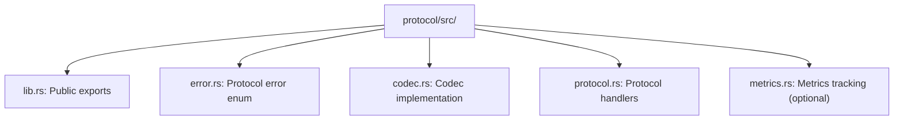

# Protocol Error Architecture

This document defines the error handling architecture for Vertex network protocols.

## Design Principles

1. **Explicit over implicit**: Every error variant must be explicitly defined
2. **Metrics-first**: All errors derive `IntoStaticStr` for automatic `LabelValue` support
3. **Flat enums**: Single-level error enums (no nesting)
4. **No escape hatches**: No `Protocol(String)` catch-alls

## Error Pattern

All protocol error enums follow the same structure. Each error type is defined as a flat enum deriving `Debug`, `thiserror::Error`, and `strum::IntoStaticStr`, with a `#[strum(serialize_all = "snake_case")]` attribute applied at the enum level.

Error variants fall into three categories:

| Category | Examples | Notes |
|----------|----------|-------|
| Lifecycle errors | `ConnectionClosed`, `Timeout` | Protocol state machine failures |
| Validation errors | `InvalidLength { expected, actual }` | Protocol-specific semantic checks |
| Infrastructure errors | `Protobuf(quick_protobuf_codec::Error)`, `Io(std::io::Error)` | Low-level library failures, using `#[from]` for automatic conversion |

Each variant has an `#[error("...")]` attribute for display formatting and, where needed, a `#[strum(serialize = "...")]` override for the metrics label (see below).

## LabelValue Trait (Automatic)

The `LabelValue` trait in `vertex-observability` provides a `label_value()` method returning a `&'static str`. It has a blanket implementation for any type where a shared reference can be converted `Into<&'static str>`. Since `IntoStaticStr` from strum provides exactly this conversion, any error enum deriving `IntoStaticStr` automatically satisfies `LabelValue`.

No manual `label()` methods are needed. Just derive `IntoStaticStr`.

To use this in metrics, call `error.label_value()` to obtain the static string for the error variant and pass it as a label value when incrementing counters.

## Error Categories

### Lifecycle Errors

Protocol state machine failures:

| Error | Description |
|-------|-------------|
| `ConnectionClosed` | Stream closed before expected message |
| `Timeout` | Operation exceeded time limit |
| `PickerRejection` | Connection rejected by peer picker |

### Validation Errors

Message content fails semantic validation:

| Error | Description |
|-------|-------------|
| `MissingField` | Required field not present |
| `InvalidLength` | Field has wrong byte length |
| `FieldTooLong` | Field exceeds maximum |
| `InvalidSignature` | Cryptographic signature invalid |
| `InvalidMultiaddr` | Multiaddr parsing failed |
| `NetworkIdMismatch` | Peer on different network |

### Infrastructure Errors

Low-level failures from underlying libraries:

| Error | Description |
|-------|-------------|
| `Protobuf` | Wire format parsing failed |
| `Io` | Stream read/write failed |

## File Organisation

## Codec Trait Requirements

The `Codec<M, E>` from `vertex-net-codec` requires that the message's `DecodeError` type converts into `E`, that `quick_protobuf_codec::Error` converts into `E`, and that `E` implements `From<std::io::Error>`. A flat error enum satisfies all three bounds via `#[from]` attributes on its `Protobuf` and `Io` variants.

## Strum Serialization

The `#[strum(serialize_all = "snake_case")]` attribute at the enum level converts variant names to snake_case automatically (e.g., `ConnectionClosed` becomes `"connection_closed"`). For variants with fields, the auto-generated name may include a suffix; use `#[strum(serialize = "...")]` on individual variants to override. For example, a `MissingField(&'static str)` variant should have `#[strum(serialize = "missing_field")]` to avoid the generated name `"missing_field_0"`. Similarly, wrapper variants like `Protobuf(...)` benefit from an explicit serialize attribute for clarity.

## Anti-Patterns

The following table describes common mistakes and their corrections:

| Anti-pattern | Problem | Correct approach |
|-------------|---------|-----------------|
| Manufacturing Io errors | Creating a `std::io::Error` to wrap a logical condition (e.g., wrapping "connection closed" in `Error::Io`) | Use a dedicated variant such as `Error::ConnectionClosed` |
| String escape hatch | Calling `.map_err(|e| Error::protocol(e.to_string()))` to convert errors through a catch-all string variant | Use a specific variant such as `Error::InvalidAddress` |
| Nested error hierarchies | Wrapping an inner error enum inside an outer enum (e.g., `OuterError::Codec(InnerCodecError)`) | Use a flat enum with all variants at the same level; this enables automatic `LabelValue` without a custom implementation |

## Requirements for New Protocols

When adding a new protocol, define a flat error enum in `error.rs` deriving `thiserror::Error` and `strum::IntoStaticStr`, with `#[strum(serialize_all = "snake_case")]` at the enum level. The enum must include a `ConnectionClosed` variant, a `Protobuf` variant with `#[from] quick_protobuf_codec::Error`, and an `Io` variant with `#[from] std::io::Error`. Add protocol-specific validation error variants as needed, using `#[strum(serialize = "...")]` on any variant that has parameters. Export the error type from `lib.rs`.
