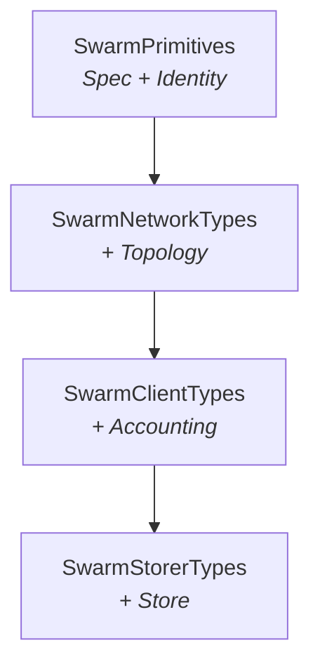

# Swarm API Architecture

The `vertex-swarm-api` crate defines the core protocol traits for Swarm operations. These traits define *what* Swarm does, not *how* it is implemented.

## Node Types

Vertex has three node types, each implementing a different level of the trait hierarchy:

| Node Type | Capabilities | Trait Level |
|-----------|--------------|-------------|
| **Bootnode** | Topology only (peer discovery) | `SwarmNetworkTypes` |
| **Client** | Topology + retrieval + upload | `SwarmClientTypes` |
| **Storer** | Full capabilities including local storage | `SwarmStorerTypes` |

## Trait Hierarchy

The type system models node capabilities as a chain of supertraits, where each level adds new associated types:

### SwarmPrimitives

Pure data types for Swarm network participation. Contains only configuration and identity data (no services). Use this when you need spec/identity without a running topology.

| Associated Type | Bound | Purpose |
|----------------|-------|---------|
| `Spec` | `SwarmSpec` | Network ID, hardforks, chunk types |
| `Identity` | `SwarmIdentity` | Cryptographic identity for handshake and routing |

### SwarmNetworkTypes

Extends `SwarmPrimitives` with topology (peer discovery service). This is the minimum for participating in the overlay network.

| Associated Type | Bound | Purpose |
|----------------|-------|---------|
| `Topology` | `SwarmTopologyState + SwarmTopologyRouting + SwarmTopologyPeers + SwarmTopologyStats` | Peer discovery and routing |

### SwarmClientTypes

Extends `SwarmNetworkTypes` with bandwidth accounting for data transfer operations.

| Associated Type | Bound | Purpose |
|----------------|-------|---------|
| `Accounting` | `SwarmClientAccounting` | Combined pricing and bandwidth accounting |

### SwarmStorerTypes

Full storage node capabilities with local chunk persistence.

| Associated Type | Bound | Purpose |
|----------------|-------|---------|
| `Store` | `SwarmLocalStore` | Local chunk storage |

## Component Containers

Each node type has a corresponding component container that holds concrete instances at runtime:

| Container | Contents | Access Traits |
|-----------|----------|---------------|
| `BootnodeComponents<T>` | Topology | `HasTopology` |
| `ClientComponents<T, A>` | Topology + Accounting | `HasTopology`, `HasAccounting` |
| `StorerComponents<T, A, S>` | Topology + Accounting + Store | `HasTopology`, `HasAccounting`, `HasStore` |

Identity is accessed via `topology().identity()` rather than a separate component.

## Key Traits

| Trait | Purpose | Node Types |
|-------|---------|------------|
| `SwarmIdentity` | Node identity, signing, overlay address | All |
| `SwarmTopologyState` | Peer discovery and routing state | All |
| `SwarmTopologyRouting` | Overlay routing decisions | All |
| `SwarmBandwidthAccounting` | Per-peer bandwidth tracking | Client, Storer |
| `SwarmLocalStore` | Local chunk persistence | Storer only |

## Protocol Integration

- `SwarmProtocol` implements `vertex_node_api::NodeProtocol`, bridging the Swarm domain with the generic node infrastructure
- `SwarmClient` and `SwarmStorer` provide high-level operations (get/put chunks, storage responsibility)

## Design Principles

### 1. Traits Define What, Implementations Define How
The API defines behaviour contracts without specifying implementation details.

### 2. No libp2p Leakage
All operations use `OverlayAddress` (32-byte Swarm address), not libp2p `PeerId`. The mapping happens in `vertex-swarm-node`.

### 3. Lock-Free Bandwidth Accounting
Per-peer handles use atomics for `record()` operations. Multiple protocols can record concurrently without contention.

## Bandwidth Accounting Design

Two-level design to avoid lock contention:

1. `SwarmBandwidthAccounting`: factory that creates per-peer handles
2. `SwarmPeerBandwidth`: per-peer handle with lock-free operations

Accounting uses overlay addresses (not `PeerId`) because:
- Accounting is tied to Swarm identity, not connection
- A peer may reconnect with a different multiaddr but the same overlay
- Settlement (SWAP cheques) is based on overlay identity

## Default Accounting Values

| Parameter | Default Value |
|-----------|---------------|
| Mode | Pseudosettle |
| Base price | 10,000 AU per chunk |
| Refresh rate | 4,500,000 AU/second |
| Payment threshold | 13,500,000 AU |
| Tolerance | 25% |
| Early payment | 50% |
| Light factor | 10 |

## See Also

- [Node Types](../architecture/node-types.md) - Bootnode, Client, Storer details
- [Client Architecture](../client/architecture.md) - libp2p integration
- [Protocols](protocols.md) - Network protocol patterns
