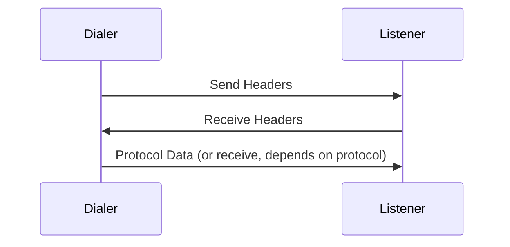

# Bee Protocol Patterns

This document describes the network protocol patterns used in Vertex (compatible with [Bee](https://github.com/ethersphere/bee)).

## Headered Streams

All Bee protocol streams use a headers exchange **except handshake**.

**Headered protocols:** hive, pricing, pushsync, retrieval, pingpong, pullsync, pseudosettle

**Non-headered:** handshake (uses SYN/ACK directly)

## Headered Protocol Abstraction

The `vertex-swarm-net-headers` crate provides composable traits for building headered protocols:

| Trait | Purpose |
|-------|---------|
| `InnerInbound` | Read protocol data after headers have been exchanged |
| `InnerOutbound` | Write protocol data after headers have been exchanged |
| `HeaderedInbound<T>` | Wraps an `InnerInbound` with automatic header exchange |
| `HeaderedOutbound<T>` | Wraps an `InnerOutbound` with automatic header exchange |

The handler receives `HeaderedInboundOutput<T>` with a `.data` field containing the protocol output.

## MultiAddr Encoding

Bee uses a custom `0x99` prefix for encoding multiple multiaddrs in a single bytes field. This is **not standard libp2p**: the standard approach uses `repeated bytes` in protobuf.

Located in `vertex-swarm-peer`: `serialize_multiaddrs()` / `deserialize_multiaddrs()`.

## Protocol Summary

| Protocol | Headered | Direction | Purpose | Crate |
|----------|:--------:|-----------|---------|-------|
| handshake | No | Bidirectional | Peer identity exchange, overlay address verification | `vertex-swarm-net-handshake` |
| hive | Yes | Request/Response | Peer discovery, neighbour lists | `vertex-swarm-net-hive` |
| pricing | Yes | Bidirectional | Bandwidth price negotiation | `vertex-swarm-net-pricing` |
| pseudosettle | Yes | Bidirectional | Bandwidth settlement (soft accounting) | `vertex-swarm-net-pseudosettle` |
| pingpong | Yes | Request/Response | Liveness checks | `vertex-swarm-net-pingpong` |
| retrieval | Yes | Request/Response | Fetch chunks by address | `vertex-swarm-net-retrieval` |
| pushsync | Yes | Request/Response | Push chunks to responsible peers | `vertex-swarm-net-pushsync` |
| pullsync | Yes | Request/Response | Sync chunks in neighbourhood | (not yet implemented) |

## See Also

- [Swarm API](api.md) - Protocol trait definitions
- [Differences from Bee](differences-from-bee.md) - Protocol improvements
